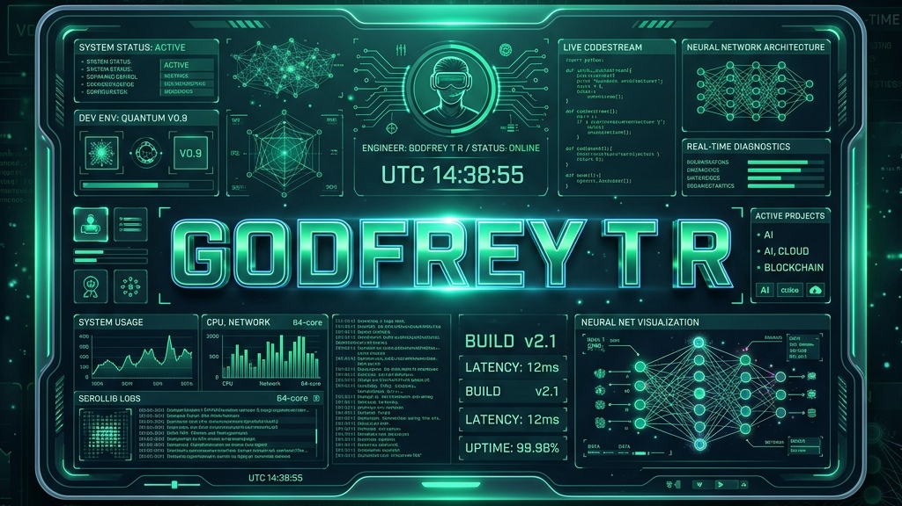

<div align="center">

<!-- Header Banner (16:9 generated asset) -->


<br><br>

<!-- Typing Animation -->


<br>

<h1>Hi 👋, I'm Godfrey T R</h1>

</div>

---

### 🌐 Live Portfolio Preview

<p align="center">
  <a href="https://the-orion-gd.vercel.app/" target="_blank">
    
  </a>
</p>

<p align="center">
  <a href="https://the-orion-gd.vercel.app/" target="_blank">
    
  </a>
</p>

---

### About Me

- 🧠 I'm a passionate AI Systems Architect, Full-Stack Product Engineer, and XR Innovator who loves engineering scalable, secure systems.
- ⚡ I'm currently focused on Agentic LLM Chains (Gemini & Groq APIs), Edge Biometrics, and Spatial Telemetry interfaces.
- 💬 Ask me about WebGL/Three.js, React 19, FastAPI, ONNX Runtime, and RAG.
- 🚀 I build products where software architecture, intelligence, and immersive experiences converge.

---

### Connect with me:

[](https://www.linkedin.com/in/godfrey192607/)
[](mailto:godfreytr.prof@gmail.com)
[](https://the-orion-gd.vercel.app/)
[](https://github.com/TheOrionGD)

---

### Languages and Tools:

[](https://skillicons.dev)

---

### Git Activeness

<p align="center">
  
  
</p>

<p align="center">
  
</p>

<p align="center">
  
</p>

---

## ⚡ system_boot_sequence

```bash
$ initialize_profile --verbose

[✓] Loading AI Engineering Modules............ SUCCESS
[✓] Loading Immersive Systems Building......... SUCCESS
[✓] Loading Client-Side Analytics Pipelines... SUCCESS
[✓] Loading Verification Dashboard............. SUCCESS
[✓] Loading Internships & Credentials.......... SUCCESS

System status: ONLINE. Welcoming connection...
```

---

## 📊 system_metrics

- 🚀 **Core Production Projects:** 7
- 🎓 **Verified Certificate Credentials:** 50
- 💡 **Patents Published:** 1
- 💼 **Professional Internships Completed:** 4
- 🏆 **Hackathon Awards Secured:** 4+
- 👥 **Leadership Roles Held:** 5+

---

## 🛰️ core_domains

### 🧠 AI Engineering
- LLM Integration & Gemini / Groq API
- RAG & Vector Search (FAISS)
- Sentence Transformers
- Whisper Speech-to-Text
- Cognitive Memory Caches

### ⚙️ System Architecture
- Full Stack MERN Ecosystems
- WebSockets & Rest APIs
- Dual-DB Sync (SQLite / Postgres)
- OAuth & JWT Security Gates
- Framework Optimizations

### 🥽 Spatial Computing
- ARCore Mobile Core
- Unity 3D & WebGL Renders
- Jetpack Compose Telemetry
- Minutiae Edge Computations
- Immersive Physics Simulators

---

## 📁 flagship_projects

### 🧠 [EchoCortex-Intelligence](https://github.com/TheOrionGD)
> **Domain:** AI Knowledge System & 3D Indexing  
> **Stack:** `React` · `Whisper` · `Sentence Transformers` · `Three.js` · `MongoDB`  
> *Captures verbal meetings, computes vector embeddings, and renders interactive 3D neural graph maps.*

### 🛡️ [FaceShield-Authentication](https://github.com/TheOrionGD)
> **Domain:** Edge AI Facial Recognition & PPE Audits  
> **Stack:** `Python` · `FastAPI` · `ONNX Runtime` · `NestJS` · `React 19` · `SQLite`  
> *Edge face detection and vest audit gate syncing over exponential backoff caches for offline sites.*

### 🏥 [EntityEase-DataPlatform](https://github.com/TheOrionGD)
> **Domain:** Clinical NLP & Classification  
> **Stack:** `FastAPI` · `BioBERT` · `FAISS Index` · `PyTorch` · `React`  
> *Extracts clinical concepts from notes, matching segments against 17k+ ICD codes in parallel threads.*

### 🌐 [AegisNet-IDS](https://github.com/TheOrionGD)
> **Domain:** Cybersecurity SIEM / SOAR  
> **Stack:** `FastAPI` · `libpcap` · `Snort 3` · `Isolation Forest` · `React`  
> *Captures inline packets, flags anomalies with ML, and auto-quarantines threat IPs on iptables/netsh.*

### 🔒 [FenceIN-AccessControl](https://github.com/TheOrionGD)
> **Domain:** Workforce Telemetry Command  
> **Stack:** `React` · `NestJS` · `pgvector` · `AES-CBC` · `PostgreSQL` · `MongoDB`  
> *Enforces geofenced shift check-ins with minutiae fingerprint templates and geofence geochecks.*

### ⚙️ [CodeSight-DeveloperToolkit](https://github.com/TheOrionGD)
> **Domain:** Explainable Code Intelligence  
> **Stack:** `Python` · `FastAPI` · `React` · `D3.js` · `Graphviz`  
> *Generates dependency architectures from code, translating UI diagram edits back to refactoring recommendations.*

### 💬 [Veltrio.Suite](https://github.com/TheOrionGD)
> **Domain:** Real-Time Translation Hub  
> **Stack:** `React` · `Vite` · `Gemini API` · `Whisper` · `JWT`  
> *Context-aware multilingual translation with sentiment check panels and dynamic theming widgets.*

---

## 🟢 AI_CORE_STATUS

```text
🟢 Prompt Engine      | ONLINE
🟢 LLM Runtime        | ONLINE
🟢 RAG Engine         | ONLINE
🟢 Agent Framework    | ONLINE
🟢 Vector Index       | ONLINE
🟢 NLP Processor      | ONLINE
🟢 ML Models          | ONLINE
```

---

## 🎓 certifications_dashboard

- 🧠 **AI & Generative AI Systems:** 25+ verified credentials
- 💻 **Full Stack & Core Systems Architecture:** 15+ verified credentials
- 🔒 **Cyber & Network Security:** 5+ verified credentials
- ☁️ **Cloud Platforms (Microsoft / AWS):** 5+ verified credentials

---

## 🏆 innovation_log

### 🏆 Patents & Competitions
- **Patent Published** — Android TV Using Remote IR Sensor (Reg: 2024)
- **OASYS Hackathon** — Best Performance Award (Access Control System Core)
- **National Science Day** — Presentation Winner (ARcore Implementations)

### 💼 Professional Internships
- **VDart Academy** — Full Stack Intern (MERN stack deployments)
- **SkillCraft** — UI/UX Design Intern (Desktop dark layouts)
- **Prodigy InfoTech** — Web Dev Intern (Location service APIs)
- **Adaovi** — Cybersecurity Intern (Entropy metrics diagnostics)

### 🥽 Leadership & Community
- **XR Club** — Vice President

---

## ⏳ system_timeline

```text
2023 ❯ Started CSE Academic Journey
2024 ❯ Patent Published (Android TV control)
2024 ❯ National Science Day Presentation Winner
2024 ❯ Web Dev Internship (Prodigy InfoTech)
2024 ❯ Cybersecurity Internship (Adaovi)
2025 ❯ UI/UX Design Internship (SkillCraft)
2025 ❯ Elected XR Club Vice President
2025 ❯ OASYS Hackathon Best Performance Award
2026 ❯ Full Stack Internship (VDart Academy)
2026 ❯ Upgraded Portfolio with 3D lattices & verification comments
```

---

## 🎯 mission_2026_2027

> [!IMPORTANT]
> **Core Objective:** Evolve into an elite AI-Native System Architect, engineering robust edge-computing platforms and real-time models.

> ### 🎛️ `[Agentic LLM Chains]`
> **Autonomous Workflows** ── Orchestrating multi-agent systems via Gemini & Groq LLM pipelines.
>
> ---
>
> ### 🧬 `[Edge Biometrics]`
> **Real-Time Inference** ── On-device facial recognition using optimized ONNX runtime engines.
>
> ---
>
> ### 💾 `[Local-first Caching]`
> **Offline Resiliency** ── Secure state synchronization using encrypted dual-database replication.
>
> ---
>
> ### 🕸️ `[Spatial Telemetry]`
> **Immersive Graphics** ── Real-time ARCore & WebGL telemetry mapping using Unity render loops.

---

## 💾 random_access_memory

> ### 🖥️ `[Favorite IDE]`
> **VS Code** ── Custom-configured development environment.
>
> ---
>
> ### 🎨 `[Terminal Theme]`
> **Cyberpunk Obsidian** ── Highly customized telemetry shell layout.
>
> ---
>
> ### ✒️ `[Coding Style]`
> **Clean, Data-Driven, Decoupled** ── Strict architecture emphasizing modularity.
>
> ---
>
> ### 🏗️ `[Build Philosophy]`
> **Compile early, lint strictly** ── Ensuring logic validation and type-safety.
>
> ---
>
> ### 🔍 `[Debug Method]`
> **Logs Audit Trail Analysis** ── Diagnostics using detailed trace analysis.
>
> ---
>
> ### ☕ `[Coffee Dependency]`
> **High** ── Powering late-night telemetry cycles.


---

<div align="center">
  
</div>
