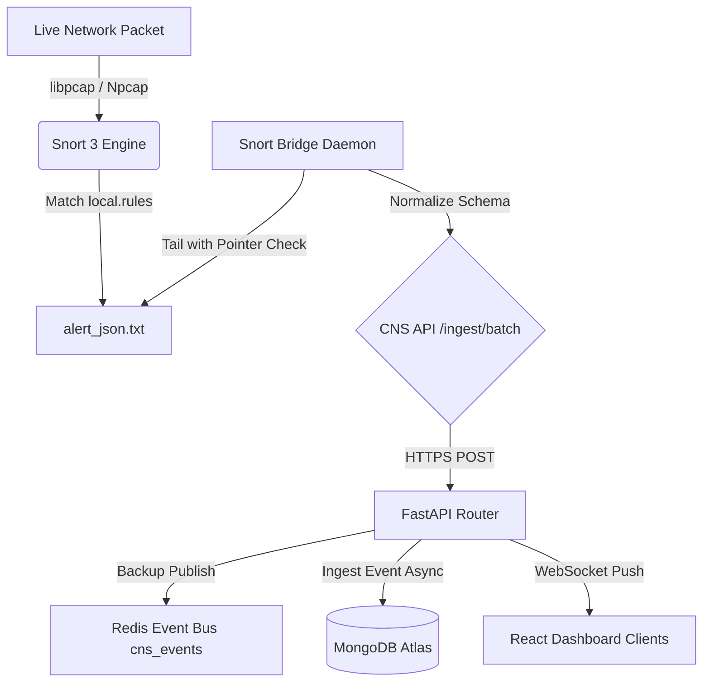
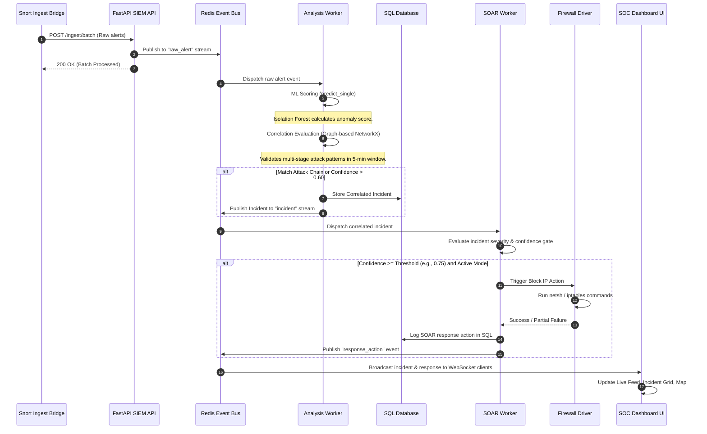

# AegisNet-IDS
```text
 █████╗ ███████╗ ██████╗ ██╗███████╗███╗   ██╗███████╗████████╗     ██╗██████╗  ██████╗
██╔══██╗██╔════╝██╔════╝ ██║██╔════╝████╗  ██║██╔════╝╚══██╔══╝     ██║██╔══██╗██╔════╝
███████║█████╗  ██║  ███╗██║███████╗██╔██╗ ██║█████╗     ██║  █████╗██║██║  ██║╚█████╗ 
██╔══██║██╔══╝  ██║   ██║██║╚════██║██║╚██╗██║██╔══╝     ██║  ╚════╝██║██║  ██║ ╚═══██╗
██║  ██║███████╗╚██████╔╝██║███████║██║ ╚████║███████╗   ██║        ██║██████╔╝██████╔╝
╚═╝  ╚═╝╚══════╝ ╚═════╝ ╚═╝╚══════╝╚═╝  ╚═══╝╚══════╝   ╚═╝        ╚═╝╚═════╝ ╚═════╝ 
                    CNS: Cryptography and Network Security
```

[](https://opensource.org/licenses/Apache-2.0)
[](https://www.python.org/)
[](https://nodejs.org/)
[](https://fastapi.tiangolo.com/)
[](https://react.dev/)
[](https://www.docker.com/)
[](#)
[](#)

A comprehensive, real-time intrusion detection, event correlation, and automated response orchestration system (SIEM + SOAR + ML) designed for modern enterprise network security operations.

---

## Executive Summary

AegisNet CNS is an enterprise-grade Security Information and Event Management (SIEM) and Security Orchestration, Automation, and Response (SOAR) platform integrated with real-time Intrusion Detection System (IDS) engines. By combining signature-based network inspection (Snort 3) with unsupervised Machine Learning (Isolation Forest) and stateful graph-based correlation (NetworkX), AegisNet CNS provides security analysts with sub-second threat detection, incident grouping, and automated active mitigation.

### High-Fidelity Hybrid Detection
Unlike traditional security platforms that analyze offline network logs retrospectively, AegisNet CNS performs **in-line live packet capture** using libpcap (Npcap on Windows) and routes raw traffic through Snort 3. The generated alert streams are enriched dynamically with ML anomaly scores, enabling the system to block known exploits using signatures while flagging novel zero-day threats through behavioral profiling.

### Key Architectural Pillars
- **Zero-Latency Alert Ingestion**: Persistent log tailing using an offset-tracked bridge daemon that streams alerts to Redis Streams and FastAPI.
- **Unsupervised Anomaly Profiling**: An Isolation Forest machine learning pipeline that extracts 19 statistical and entropy-based network features over a rolling 60-second window.
- **Stateful Attack Chain Correlation**: A correlation engine built on Graph Theory (using `NetworkX`) that groups discrete events into unified multi-stage incidents (Reconnaissance $\rightarrow$ Delivery $\rightarrow$ Anomaly $\rightarrow$ Action).
- **Sanitized SOAR Action Playbooks**: A thread-safe, command-injection-proof execution engine that interacts with Windows `netsh` and Linux `iptables` drivers to quarantine attackers in under 2 seconds.
- **Real-Time SOC Visualization**: A responsive React/Vite dashboard driven by persistent WebSockets that gives Security Operations Center (SOC) teams live incident management, timelines, and attack flow visualization.

---

## Developer Story

AegisNet-IDS (CNS: Cryptography and Network Security) was conceived to solve the classic security engineer's dilemma: **alert fatigue** versus **coverage gaps**. In typical corporate infrastructure, Security Operations Centers (SOCs) are inundated with thousands of false positives and signature matches daily, while still remaining blind to zero-day attacks.

We built this project to prove that modern intrusion detection can be stateful, proactive, and automated. By pairing the signature-matching precision of Snort 3 with the unsupervised anomaly profiling of an Isolation Forest machine learning model, AegisNet-IDS detects both known exploits and unknown anomalies. 

To bridge the gap between detection and response, the system utilizes a persistent event-driven architecture using Redis Streams and Python. The stateful correlation engine uses network graphs (via NetworkX) to track attacker progression across the kill chain (Reconnaissance, Delivery, Anomaly, and Action) over a rolling 5-minute window. When a multi-stage attack pattern matches, the SOAR engine triggers automated firewalls drops (using Linux iptables or Windows netsh drivers) in under 2 seconds. The result is a resilient, enterprise-grade hybrid security framework designed for modern virtualized and physical infrastructure.

---

## Table of Contents

1. [Executive Summary](#executive-summary)
2. [Developer Story](#developer-story)
3. [System Architecture](#system-architecture)
   - [High-Level Architecture](#high-level-architecture)
   - [Ingestion Workflow](#ingestion-workflow)
   - [Mitigation & Correlation Sequence](#mitigation--correlation-sequence)
4. [Technology Stack](#technology-stack)
5. [Project Directory & File Structure](#project-directory--file-structure)
6. [Core Components Deep Dive](#core-components-deep-dive)
   - [Snort 3 Ingestion Bridge](#snort-3-ingestion-bridge)
   - [Machine Learning Engine (MLEngine)](#machine-learning-engine-mlengine)
   - [Stateful Correlation Engine](#stateful-correlation-engine)
   - [SOAR Active Mitigation Engine](#soar-active-mitigation-engine)
7. [Installation & Deployment](#installation--deployment)
   - [Local Prerequisites](#local-prerequisites)
   - [Development Setup](#development-setup)
   - [VMware Virtualization & Promiscuous Mode Setup](#vmware-virtualization--promiscuous-mode-setup)
   - [Docker Production Deployment](#docker-production-deployment)
8. [Configuration & Environment Profiles](#configuration--environment-profiles)
   - [System Configuration (config.yaml)](#system-configuration-configyaml)
9. [API & WebSocket Documentation](#api--websocket-documentation)
   - [REST Endpoint Reference](#rest-endpoint-reference)
   - [WebSocket Event Schema](#websocket-event-schema)
10. [Threat Simulation & Verification Procedures](#threat-simulation--verification-procedures)
    - [Traffic Baselines](#traffic-baselines)
    - [Reconnaissance Attack Scenario](#reconnaissance-attack-scenario)
    - [SYN DoS Flood Attack Scenario](#syn-dos-flood-attack-scenario)
    - [Web Application Exploitation Scenario](#web-application-exploitation-scenario)
    - [C2 Beaconing Scenario](#c2-beaconing-scenario)
11. [Security, Controls & Compliance](#security-controls--compliance)
12. [Troubleshooting & Maintenance](#troubleshooting--maintenance)
13. [Frequently Asked Questions (FAQs)](#frequently-asked-questions-faqs)
14. [Contributing & Code Standards](#contributing--code-standards)
15. [License](#license)

---

## System Architecture

### High-Level Architecture

The system uses a distributed microservices pattern. Ingestion daemons running close to network taps (e.g., inside virtualized VMware networks) write alerts locally, which are sent to the core SIEM API. Background workers process alerts asynchronously via a Redis event bus, maintaining decoupled data stores for raw event storage, relational indexing, and real-time visualization.

```
                                      +--------------------------+
                                      |    VMware / Physical     |
                                      |    Promiscuous Network   |
                                      +--------------------------+
                                                    |
                                                    v
                                      +--------------------------+
                                      |  Snort 3 Signature IDS   |
                                      +--------------------------+
                                                    | (alert_json.txt)
                                                    v
                                      +--------------------------+
                                      |    Snort Ingest Bridge   |
                                      |   (offset tracking tail) |
                                      +--------------------------+
                                                    | (REST /ingest/batch)
                                                    v
                                      +--------------------------+
                                      |     FastAPI SIEM API     |
                                      +--------------------------+
                                        /                      \
                                       v                        v
                        +----------------------+        +----------------------+
                        |   Redis Event Bus    |        |  MongoDB Atlas Cloud |
                        | (Stream Processing)  |        | (Raw Event Archive)  |
                        +----------------------+        +----------------------+
                          /                  \
                         v                    v
            +--------------------+    +--------------------+
            |  Analysis Worker   |    |    SOAR Worker     |
            | - Realtime ML      |    | - Response Engine  |
            | - Graph Correlation|    | - Firewall Drivers |
            +--------------------+    +--------------------+
                      |                         |
                      +-----------+-------------+
                                  |
                                  v
                       +----------------------+
                       | PostgreSQL Metadata  |
                       |  (Incidents/Actions) |
                       +----------------------+
                                  |
                                  v
                       +----------------------+
                       |  React SOC Dashboard |
                       | (WebSocket Broadcast)|
                       +----------------------+
```

### Ingestion Workflow



### Mitigation & Correlation Sequence



---

## Technology Stack

The following matrix documents the libraries, tools, and platforms that form AegisNet CNS:

| Component | Technology | Version | Purpose / Implementation Notes |
| :--- | :--- | :--- | :--- |
| **Frontend Framework** | React / Vite | `^19.2.4` / `^8.0.4` | Single Page Application (SPA) dashboard for real-time visualization. |
| **State Management** | Zustand | `^5.0.12` | Lightweight store for active alerts, incidents, and system metrics. |
| **Data Querying** | TanStack React Query | `^5.96.2` | Manages server state cache and asynchronous REST endpoints polling. |
| **UI Components** | Lucide React / Recharts | `^1.7.0` / `^3.8.1` | Rich UI icons and responsive, SVG-based charting (timeline, top IPs, distribution). |
| **Styling Engine** | Vanilla CSS / TailwindCSS | `^3.4.19` | Premium styling with dynamic Glassmorphism overlays and dark mode theme. |
| **Backend Core** | FastAPI | `^0.103.0` | High-performance ASGI REST and WebSocket application server. |
| **Application Server** | Uvicorn | `^0.23.2` | High-throughput ASGI server implementation with async thread pools. |
| **Event Bus** | Redis / Redis Streams | `^5.0.0` | Durability-assured message distribution hub with Kafka-like consumer groups. |
| **SQL Database Engine** | PostgreSQL / SQLite | `^2.0.0` (SQLAlchemy) | Relational storage for users, RBAC roles, correlated incidents, and SOAR actions. |
| **NoSQL Database** | MongoDB Atlas Cloud | `^4.5.0` (PyMongo/Motor) | Document store for high-volume raw security alerts and ML feature frames. |
| **Search Engine** | Elasticsearch | `^8.10.0` | Indexes SIEM events for rapid text searching and log analysis. |
| **Machine Learning** | Scikit-Learn | `^1.3.0` | Isolation Forest unsupervised model implementation and evaluation. |
| **Data Processing** | Pandas / Numpy | `^2.0.0` / `^1.24.0` | In-memory feature engineering, matrix math, and sliding window scaling. |
| **Graph Modeling** | NetworkX | `^3.1` | Direct and undirected topological graphs for stateful alert chain correlation. |
| **File Watcher** | Watchdog | `^3.0.0` | Cross-platform OS level file system event listener for log monitoring. |
| **Network Analyzer** | Scapy | `^2.5.0` | Deep packet inspection, pcap parsing, and raw interface bindings. |
| **Virtualization Platform** | VMware Workstation Pro / Player | `16.x` / `17.x` | Hypervisor sandbox hosting network nodes. Used to enable Promiscuous Mode capture on virtual switches (VMnet), allowing the IDS to sniff and analyze inter-VM network traffic safely without affecting physical infrastructure. |

---

## Project Directory & File Structure

```
AegisNet-IDS/
├── back-end/                         # Python FastAPI API & Core SIEM Workers
│   ├── api/                          # REST & WebSockets interface endpoints
│   ├── core/                         # ML Engine, SOAR Response, & Event Bus pipelines
│   └── ml_services/                  # Offline training & feature engineering
├── config/                           # Application YAML & Snort 3 local rules/configuration
├── docker/                           # Container deployment profiles
├── docs/                             # VMware guides & design manuals
├── front-end/                        # React / Vite SPA Dashboard UI
└── scripts/                          # Threat simulator & baseline network traffic generators
```

---

## Core Components Deep Dive

### Snort 3 Ingestion Bridge

The Snort Bridge Daemon ([snort_bridge.py](file:///e:/GitHub-Repos/AegisNet-IDS/back-end/core/snort_bridge.py)) serves as the primary system ingestion interface. Running locally as a background daemon, it is designed for high-availability log forwarding:

1. **Stateful Offset Tracking**: Tailing files in production is risky due to application restarts and log rotations. The bridge creates a pointer file ([alert_json.txt.pointer](file:///e:/GitHub-Repos/AegisNet-IDS/alert_json.txt.pointer)) that saves the exact byte position in the file. Upon restart, it reads the pointer and performs a `.seek(offset)` to avoid repeating alerts.
2. **Rotation Awareness**: If the target log file size drops below the current pointer position, the bridge automatically identifies a log rotation, closes the existing handle, resets the pointer to 0, and opens the new file.
3. **Data Normalization**: It maps the Snort JSON schema to the AegisNet Unified Event Schema:
   - Snort rule priority values are mapped dynamically to standard threat levels: `Priority 1` $\rightarrow$ `HIGH`, `Priority 2` $\rightarrow$ `MEDIUM`, `Priority 3` $\rightarrow$ `LOW`.
   - Raw packet fields (`src_addr`, `dst_addr`, `proto`) are normalized, and the complete Snort metadata is packaged in the `raw` JSON field.
4. **Resiliency Mode**: If the core SIEM API is offline, the bridge enqueues alerts in a local memory buffer and publishes them to the Redis event bus if reachable. This keeps ingestion running without dropping alerts during API upgrades.

### Machine Learning Engine (MLEngine)

The system features real-time unsupervised anomaly detection, driven by the custom [MLEngine](file:///e:/GitHub-Repos/AegisNet-IDS/back-end/core/ml_engine.py). It uses an **Isolation Forest** model to flag outlier activity that doesn't match standard traffic profiles:

- **Aggregated Window Features**: Rather than examining packets in isolation, the feature engineer ([feature_engineering.py](file:///e:/GitHub-Repos/AegisNet-IDS/back-end/ml_services/feature_engineering.py)) evaluates traffic vectors within a rolling window:
  - **Packet Volume**: Total counts, rates per second, and rate-of-change statistics.
  - **Packet Length Profile**: Minimum, maximum, average, and standard deviation of packet lengths.
  - **Entropy Profile**: Shannon entropy of destination IP addresses, which identifies random target scanning or multi-destination beaconing.
  - **Connection Diversity**: Counts of unique source ports, destination ports, source IPs, and destination IPs.
  - **Protocol Balance**: Ratios of TCP, UDP, and ICMP packets.
  - **Traffic Directionality**: Count and ratio of internal-to-internal vs. internal-to-external communication.
- **Dynamic Anomaly Scoring**: The model produces anomaly decision scores. These are scaled to a user-friendly $[0, 1]$ range, where values $\ge 0.50$ (configurable in config.yaml) are classified as anomalous. The scoring logic triggers alerts for anomalous behavior, automatically elevating the alert severity to `HIGH`.

### Stateful Correlation Engine

Individual alerts can cause alert fatigue in security teams. The AegisNet SIEM Correlation Engine ([correlation_engine.py](file:///e:/GitHub-Repos/AegisNet-IDS/back-end/siem/correlation_engine.py)) uses graph theory to group alerts into multi-stage incidents:

1. **Graph Construction**: The engine builds a directed graph (using `NetworkX`) for each source IP. Alerts are represented as nodes, and temporal edges are created between events occurring within 120 seconds of each other.
2. **Tactical Windows**: States are maintained in-memory for 5 minutes (300 seconds). After this window, stale graphs are cleared automatically to keep memory consumption low.
3. **Attack Chain Identification**: The engine performs path analysis, checking nodes against keywords that map to stages of the cyber kill chain:
   - **Reconnaissance**: Scan, Enumeration, Port probing.
   - **Delivery**: SQL Injection, HTTP exploits, payload downloads.
   - **Anomaly**: Anomalous packet rates, high entropy, custom ML flags.
   - **Action**: Command & Control (C2) beaconing, data exfiltration, database access.
4. **Probabilistic Scoring**: A confidence score is calculated based on active stages ($w_{recon}=0.2, w_{delivery}=0.4, w_{anomaly}=0.3, w_{action}=0.5$). If the attacker traverses multiple stages or if severity boosts (e.g., a `CRITICAL` alert adds $+0.2$) lift the score past `0.60`, a unified incident is generated and stored.

### SOAR Active Mitigation Engine

The SOAR Response Engine ([response_engine.py](file:///e:/GitHub-Repos/AegisNet-IDS/back-end/core/response_engine.py)) handles automated mitigation. It evaluates security incidents and executes response playbooks:

- **Firewall Drivers**: The engine uses an abstract `FirewallDriver` interface to support multiple platforms:
  - **Linux Driver**: Interacts with `iptables` to insert drop rules dynamically.
  - **Windows Driver**: Interacts with `netsh advfirewall` to add inbound block rules.
- **Sanitized Execution**: To prevent command injection attacks, all IP addresses are validated using Python's `ipaddress` library before generating command strings. Commands are executed via `subprocess.run` with `shell=False` to ensure strict parameterization.
- **Snort Block Rules**: When an IP is blocked, the engine generates a Snort rule (e.g., `drop ip <attacker_ip> any -> any any`) and appends it to `generated_rules.rules`. It also records firewall block commands in `data/firewall_rules.sh` to allow rules to persist after restarts.
- **Safe Mode Protection**: In safe mode (`safe_mode: true` in config.yaml), the engine models the actions, logs the commands, and writes the rules without modifying the host firewall. This allows security teams to validate responses before enabling active blocking.

---

## Installation & Deployment

### Local Prerequisites

Before deploying the platform, ensure the following software is installed on the host system:

- **Python**: Version `3.8` up to `3.11` (with `pip` and `virtualenv` available).
- **Node.js**: Version `16.0` or higher (packaged with `npm`).
- **Snort 3**: Installed on the host or target virtual machine.
- **Npcap** (Windows only): Installed in **WinPcap API-compatible mode**.
- **Docker & Compose**: Required for containerized database services.
- **Redis Server**: Required for event bus queues (if running locally outside Docker).

---

### Development Setup

Follow these steps to configure a local development environment:

#### 1. Repository Initialization
Clone the repository and navigate to the project directory:
```bash
git clone https://github.com/TheOrionGD/AegisNet-IDS.git
cd AegisNet-IDS
```

#### 2. Backend Environment Setup
Create a virtual environment and install the required dependencies:
```bash
# Navigate to the backend folder
cd back-end

# Create the virtual environment
python -m venv venv

# Activate the environment
# On Windows:
.\venv\Scripts\activate
# On Linux/macOS:
source venv/bin/activate

# Install dependencies
pip install -r requirements.txt
```

#### 3. Database Initialization
Start the database services (PostgreSQL, MongoDB Atlas, Redis) using Docker:
```bash
# From the root project folder
docker-compose --profile infra up -d
```
Initialize the SQL schema and apply seed data:
```bash
# Apply SQL schemas
python seed_users.py
python seed_anomalies.py
```

#### 4. Frontend Environment Setup
Open a separate terminal window and install the frontend dependencies:
```bash
cd front-end
npm install
```

#### 5. Start the Application
Run the orchestrator script to boot the backend services, background workers, and log bridges:
```bash
# From the root project directory (in the backend virtual environment)
python run_system.py
```
In your frontend terminal, launch the Vite React dev server:
```bash
# From the front-end directory
npm run dev
```
Open a browser and navigate to `http://localhost:5173` to access the SOC dashboard. Default credentials:
- **Username**: `admin`
- **Password**: `AEGISNET-IDS@SECURE`

---

### VMware Virtualization & Promiscuous Mode Setup

To monitor virtual machines running in a virtual environment (like VMware Workstation), the virtual network interfaces must be configured to capture all network traffic, not just traffic addressed to the host.

```
       Host Network Card (Physical NIC)
                     |
                     v
       VMware Virtual Network Editor
    [VMnet8 (NAT) - Set to Promiscuous Mode]
         /                       \
        v                         v
+--------------+           +--------------+
|  Target VM   |           | AegisNet IDS |
|  (User / IP) |           |  Monitor VM  |
+--------------+           +--------------+
```

Follow these steps to configure the virtual network:

#### Step 1: VMware Virtual Network Editor Configuration
1. Open the **Virtual Network Editor** as an Administrator.
2. Select the network adapter to monitor (typically `VMnet8` for NAT traffic, or `VMnet0` for bridged network access).
3. Ensure **"Connect a host virtual adapter to this network"** is checked.
4. Click **Apply** and then **OK** to save the network settings.

#### Step 2: Virtual Machine Settings
1. Open your virtual machine settings page.
2. Set the Network Adapter type to **Custom**, and select the VMnet interface configured in Step 1 (e.g., `VMnet8`).
3. If running on an ESXi host or advanced hypervisor, modify the security policy of the virtual switch port group:
   - **Promiscuous Mode**: Set to **Accept**.
   - **MAC Address Changes**: Set to **Accept**.
   - **Forged Transmits**: Set to **Accept**.

#### Step 3: Windows Host Configurations (Npcap)
1. Download Npcap from [nmap.org/npcap/](https://nmap.org/npcap/).
2. Run the installer and check the option **"Install Npcap in WinPcap API-compatible mode"**.
3. Open PowerShell as an Administrator and verify that the VMware interface is visible:
   ```powershell
   Get-NetAdapter | Where-Object { $_.InterfaceDescription -match "VMware" }
   ```
4. Run the Snort launch script to select the active interface and start packet capture:
   ```powershell
   powershell -ExecutionPolicy Bypass -File scripts\run_snort_windows.ps1
   ```

---

### Docker Production Deployment

For production deployments, AegisNet CNS uses Docker Compose profiles to split infrastructure databases from core analytical microservices.

```bash
# 1. Start persistent data stores (Redis, Postgres)
docker-compose --profile infra up -d

# 2. Wait for databases to initialize, then boot analytical services
docker-compose --profile core up -d
```

#### Production Port Mapping Reference
- **Nginx Ingress / Frontend SPA**: `80` / `443`
- **FastAPI Core Gateway API**: `2346`
- **Redis Cache & Streams Bus**: `6379`
- **PostgreSQL Database**: `5432`

---

## Configuration & Environment Profiles

### System Configuration (config.yaml)

The central configuration options are managed in [config.yaml](file:///e:/GitHub-Repos/AegisNet-IDS/config/config.yaml). The table below lists the configurable parameters:

| Config Key Path | Data Type | Default Value | Purpose / Operational Impact |
| :--- | :--- | :--- | :--- |
| `model.contamination` | Float | `0.05` | Outlier proportion for the Isolation Forest model. |
| `threshold.anomaly_score` | Float | `-0.45` | Raw decision threshold. Scores below this are flagged as anomalies. |
| `feature.window_size` | String | `1min` | The sliding window duration used to aggregate raw logs into feature vectors. |
| `database.url` | String | `mongodb+srv://...` | Connection URI for the MongoDB Atlas event archive database. |
| `siem.correlation.window_minutes` | Integer | `5` | Timeframe in minutes used to group correlated events. |
| `siem.correlation.high_severity_threshold` | Integer | `5` | Minimum event count within the window to trigger a high-severity incident. |
| `soar.safe_mode` | Boolean | `true` | When true, response commands are logged instead of executed. |
| `soar.execute` | Boolean | `false` | Global kill switch for the SOAR execution workers. |
| `soar.confidence_threshold` | Float | `0.75` | Minimum correlation confidence score required to trigger active blocking. |
| `bus.redis_url` | String | `redis://localhost:6379` | Connection string for the Redis Streams message bus. |
| `virtualization.hypervisor` | String | `vmware` | Hypervisor deployment target (`vmware`, `virtualbox`, `physical`). |
| `virtualization.network.promiscuous_mode` | Boolean | `true` | Configures the ingestion driver to capture all traffic on the interface. |

---

## API & WebSocket Documentation

### REST Endpoint Reference

All API endpoints require a valid JWT token passed in the authorization header, except for public authentication and health routes:
`Authorization: Bearer <JWT_TOKEN>`

#### 1. Authentication
* **`POST /auth/register`**
  * Description: Register a new system analyst or administrator.
  * Request Body:
    ```json
    {
      "username": "analyst_john",
      "email": "john@aegisnet.local",
      "password": "SecurePassword123!",
      "role": "analyst"
    }
    ```
  * Response (201 Created):
    ```json
    {
      "id": "e8a15fd4-436d-4950-9c1a-2895fc8849b2",
      "username": "analyst_john",
      "role": "analyst",
      "is_active": true
    }
    ```

* **`POST /auth/token`**
  * Description: Authenticate and retrieve a JWT access token.
  * Request Body (Form URL Encoded):
    * `username`: `analyst_john`
    * `password`: `SecurePassword123!`
  * Response (200 OK):
    ```json
    {
      "access_token": "eyJhbGciOiJIUzI1NiIsIn...",
      "token_type": "bearer",
      "role": "analyst"
    }
    ```

#### 2. Security Alerts
* **`GET /alerts`**
  * Description: Retrieve normalized intrusion alerts.
  * Parameters:
    * `limit` (Query Integer, Default: 50): Number of events to return.
  * Response (200 OK):
    ```json
    [
      {
        "id": "c13568ea-ea5c-44bf-8d26-7ad3e4a2b9d3",
        "timestamp": "2026-06-05T18:30:10Z",
        "source": "snort",
        "event_type": "SERVER-APACHE Apache log4j remote code execution attempt",
        "severity": "HIGH",
        "src_ip": "192.168.8.12",
        "dst_ip": "192.168.8.100",
        "src_port": 58349,
        "dst_port": 8080,
        "protocol": "TCP",
        "ml_score": 0.12,
        "ml_is_anomaly": false
      }
    ]
    ```

* **`POST /ingest/batch`**
  * Description: Ingest raw Snort JSON alerts.
  * Request Body:
    ```json
    [
      {
        "timestamp": "2026-06-05T18:31:00Z",
        "pkt_num": 1492,
        "src_addr": "10.0.2.15",
        "dst_addr": "192.168.1.50",
        "src_port": 4022,
        "dst_port": 80,
        "proto": "TCP",
        "rule": {
          "gid": 1,
          "sid": 1000003,
          "rev": 1,
          "msg": "NMAP Port Scan Detected",
          "priority": 2
        }
      }
    ]
    ```
  * Response (200 OK):
    ```json
    {
      "status": "processed",
      "count": 1,
      "anomalies": 0
    }
    ```

#### 3. Incident Management
* **`GET /incidents`**
  * Description: Retrieve correlated security incidents.
  * Parameters:
    * `limit` (Query Integer, Default: 50): Max incidents.
  * Response (200 OK):
    ```json
    [
      {
        "incident_id": "INC-A9F8E41D",
        "incident_type": "MULTI-STAGE ATTACK",
        "src_ip": "10.0.2.15",
        "alert_count": 8,
        "severity": "CRITICAL",
        "confidence": 0.88,
        "attack_pattern": ["PORT_SCAN", "SQL_INJECTION", "ML_ANOMALY"],
        "stages": ["RECON", "DELIVERY", "ANOMALY"],
        "start_time": "2026-06-05T18:25:00Z",
        "end_time": "2026-06-05T18:30:00Z",
        "ml_contributed": true
      }
    ]
    ```

#### 4. Anomalies & Inference
* **`POST /detect/infer`**
  * Description: Trigger manual ML inference on a single event vector.
  * Request Body:
    ```json
    {
      "pkt_len": 1500,
      "src_ip": "192.168.1.20",
      "dst_ip": "192.168.1.99",
      "src_port": 443,
      "dst_port": 50321,
      "protocol": "TCP"
    }
    ```
  * Response (200 OK):
    ```json
    {
      "status": "success",
      "result": {
        "anomaly_score": 0.762,
        "is_anomaly": true,
        "risk_level": "HIGH",
        "raw_decision": -0.262
      }
    }
    ```

---

### WebSocket Event Schema

The React dashboard connects to `/ws/events` to receive real-time JSON event streams:

```json
{
  "event_type": "incident",
  "data": {
    "incident_id": "INC-7D8E2A1C",
    "src_ip": "192.168.8.45",
    "dst_ip": "192.168.8.100",
    "src_port": 52143,
    "dst_port": 22,
    "protocol": "TCP",
    "incident_type": "SUSPICIOUS CHAIN",
    "confidence": 0.78,
    "severity": "HIGH",
    "ml_contributed": true,
    "start_time": "2026-06-05T18:32:00Z",
    "end_time": "2026-06-05T18:32:05Z",
    "ml_score": 0.78,
    "risk_level": "HIGH",
    "source": "snort"
  }
}
```

---

## Threat Simulation & Verification Procedures

The platform includes a Threat Simulation Engine ([threat_simulator.py](file:///e:/GitHub-Repos/AegisNet-IDS/scripts/threat_simulator.py)) to test detection and mitigation playbooks in a controlled environment.

```
                  +--------------------------------+
                  |    Threat Simulation Engine    |
                  |     (scripts/threat_simulator) |
                  +--------------------------------+
                    /        |           \        \
                   v         v            v        v
            Reconnaissance  SYN Flood    SQLi     C2 Beacon
             (Port Scan)    (Anomaly)   (Payload) (Correlation)
```

### Traffic Baselines

Before simulating attacks, generate a standard traffic baseline to train the Isolation Forest model:
```bash
# Generate baseline traffic for 10 minutes (600 seconds)
python scripts/simulate_network_traffic.py --duration 600 --intensity medium
```
Once the baseline traffic is logged in the database, trigger model training:
```bash
python back-end/ml_services/train_model.py
```
Verify that the output binaries are updated:
* [isolation_forest.joblib](file:///e:/GitHub-Repos/AegisNet-IDS/models/isolation_forest.joblib)
* [scaler.joblib](file:///e:/GitHub-Repos/AegisNet-IDS/models/scaler.joblib)

---

### Reconnaissance Attack Scenario

Simulate a port scan to verify signature-based rule detection:
```bash
python scripts/threat_simulator.py --mode live --target 192.168.8.100 --attack recon
```
* **Expected Result**: Snort triggers rule `sid:1000001` (Port Scan). The event appears in the SOC dashboard alerts feed in under 1 second.

---

### SYN DoS Flood Attack Scenario

Simulate a high-volume packet burst to test anomaly detection:
```bash
python scripts/threat_simulator.py --mode live --target 192.168.8.100 --attack dos
```
* **Expected Result**: The ML engine aggregates traffic features over the rolling window, identifies the outlier rate, and logs an anomaly score $> 0.85$.

---

### Web Application Exploitation Scenario

Simulate web application attacks (such as SQL Injection or Cross-Site Scripting payloads) to test signature detection:
```bash
python scripts/threat_simulator.py --mode live --target 192.168.8.100 --attack web
```
* **Expected Result**: Snort matches the payload patterns in the rule database, generating high-severity alert messages like `SQL Injection Attempt`.

---

### C2 Beaconing Scenario

Simulate a Command & Control beaconing pattern (low-volume, periodic connections over a long duration) to test the correlation engine:
```bash
python scripts/threat_simulator.py --mode live --target 192.168.8.100 --attack c2
```
* **Expected Result**: The correlation engine traces the attack path through the stages (**Reconnaissance** $\rightarrow$ **Anomaly** $\rightarrow$ **Action**), links the events, and generates a unified multi-stage incident (`INC-XXXX`).

---

## Security, Controls & Compliance

AegisNet CNS is designed to follow standard security compliance controls (such as SOC 2 Type II, ISO 27001, and NIST 800-53):

- **Data Sanitization**: All incoming inputs, parameter strings, and IP addresses are parsed and sanitized using explicit models (`pydantic` schemas) to block SQL injection and OS command injection attacks.
- **Role-Based Access Control (RBAC)**: User privileges are enforced via decorators at the API routing layer:
  - `analyst`: Can view alerts, incidents, anomalies, and logs.
  - `admin`: Full administrative access, including configuring SOAR rules, initiating ML retraining, and managing users.
- **Cryptographic Security**: Passwords are hashed using `bcrypt` with 12 computational rounds. Session authorization is managed via JWT tokens signed with `HMAC-SHA256` keys.
- **Secure Encrypted Communication**: Includes shell scripts ([generate_ssl.sh](file:///e:/GitHub-Repos/AegisNet-IDS/generate_ssl.sh)) to generate local TLS certificates. This ensures all REST API traffic, WebSocket streams, and dashboard interfaces run over encrypted HTTPS/WSS channels.

---

## Troubleshooting & Maintenance

The table below describes common troubleshooting scenarios:

| Diagnostic Symptom | Probable Root Cause | Verification Command & Solution |
| :--- | :--- | :--- |
| **No alerts appear in the dashboard feed** | Snort is not capturing packets on the correct interface, or the bridge is stopped. | Run `snort --list-interfaces` in a terminal. Verify that the active adapter ID matches the configuration in [config.yaml](file:///e:/GitHub-Repos/AegisNet-IDS/config/config.yaml). |
| **Backend boot crashes on port conflicts** | Uvicorn is trying to bind to a port that is already in use by another service (e.g., port 2346). | Run `netstat -ano \| findstr 2346` (Windows) or `ss -lptn \| grep 2346` (Linux). Kill the blocking process or set a new `API_PORT` in your `.env` file. |
| **MongoDB Atlas connection timeout** | The host IP is not added to the MongoDB Atlas network access IP whitelist, or credentials are invalid. | Log in to the MongoDB Atlas dashboard. Navigate to **Network Access**, click **Add IP Address**, and add your public IP or choose `0.0.0.0/0` for testing. |
| **CORS errors in the web browser console** | The frontend domain is not allowed by the FastAPI CORS middleware settings. | Check `api/main.py`. Ensure that `allow_origins` is set to `["*"]` in development, or configured to match your exact frontend domain in production. |
| **ML Engine shows zero-shot/disabled mode** | The model files ([isolation_forest.joblib](file:///e:/GitHub-Repos/AegisNet-IDS/models/isolation_forest.joblib)) are missing from the `models/` directory. | Run the training script manually: `python back-end/ml_services/train_model.py`. This will generate new model and scaler binaries. |
| **VMware traffic is not being captured** | Promiscuous mode is disabled on the VMnet virtual switch, or Npcap is missing WinPcap compatibility. | Re-run the Npcap installer. Ensure the WinPcap compatibility mode checkbox is checked during installation. |

---

## Frequently Asked Questions (FAQs)

#### Q: How does the system handle high-volume packet bursts (e.g., 10Gbps+ networks)?
**A**: For high-volume networks, you can decouple the ingestion layer from the analysis workers by deploying the [Kafka Bridge](file:///e:/GitHub-Repos/AegisNet-IDS/back-end/core/kafka_bridge.py). This allows you to partition and distribute message consumption across a cluster of backend analysis instances.

#### Q: Can AegisNet CNS block attackers automatically on the Windows host firewall?
**A**: Yes. If you configure `safe_mode: false` and `execute: true` under the `soar` block in [config.yaml](file:///e:/GitHub-Repos/AegisNet-IDS/config/config.yaml), the Windows Netsh firewall driver will add inbound block rules dynamically when it detects high-severity incidents.

#### Q: How often should the Isolation Forest model be retrained?
**A**: We recommend retraining the model weekly or after significant changes to your network infrastructure. You can use the retraining scripts in [adaptive_learning.py](file:///e:/GitHub-Repos/AegisNet-IDS/back-end/core/adaptive_learning.py) to configure automated retraining crons.

#### Q: Can I integrate external Threat Intelligence feeds?
**A**: Yes. The system has built-in integration points in the threat intelligence module ([ip_reputation.py](file:///e:/GitHub-Repos/AegisNet-IDS/back-end/core/ip_reputation.py)). You can configure external API keys (like VirusTotal or AlienVault OTX) in `config.yaml` to enrich alert metadata.

---

## Contributing & Code Standards

We welcome contributions to AegisNet CNS! To maintain code quality:

### Formatting & Style
* **Python**: Enforce PEP 8 styles using `black` and `flake8` auto-formatters.
* **JavaScript / React**: Use `eslint` rules defined in `eslint.config.js`.

### Branching Model
1. Fork the repository and create a feature branch (`git checkout -b feature/your-feature-name`).
2. Commit your modifications. Include unit test coverage for any new features.
3. Submit a Pull Request targeting the `main` branch. Provide a detailed summary of the changes in the PR description.

---

## License

This project is licensed under the Apache License 2.0 - see the [LICENSE](LICENSE) file for details.
