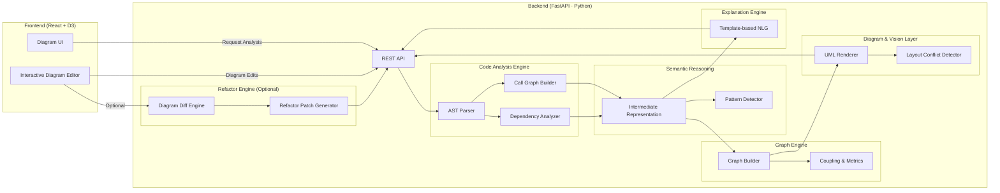
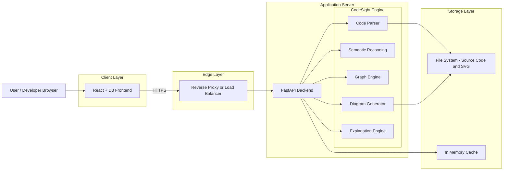
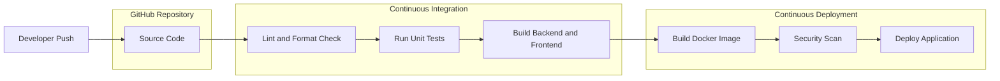

# CodeSight-Py

**Automatic Code-to-Diagram Generator with Semantic Reasoning**

CodeSight-Py is a Python-based system that analyzes source code, extracts its semantic structure, generates UML and architecture diagrams, and produces human-readable explanations of how the system works. Beyond visualization, it explores a bidirectional workflow where diagram edits can be translated into safe refactoring suggestions.

This project sits at the intersection of **Software Engineering, Computer Vision (visual reasoning), and Advanced NLP**, focusing on *explainable code intelligence* rather than black-box automation.

---

## 1. Problem Statement

Modern codebases grow faster than human understanding. While static analysis tools and UML generators exist, they typically:

* Stop at syntactic parsing
* Produce diagrams without explanation
* Fail to reason about architecture quality
* Do not support feedback from diagrams back to code

CodeSight-Py addresses this gap by treating code, diagrams, and language as **three representations of the same underlying intent**.

---

## 2. Project Objectives

* Parse source code into a language-agnostic semantic representation
* Generate UML and architecture diagrams automatically
* Apply visual reasoning to detect layout and design conflicts
* Explain system structure in clear technical language
* (Stretch) Map diagram edits back to refactoring suggestions

---

## 3.1 System Architecture (High Level)



Each layer is independently testable and extensible.

---

## 3.2 Developement Architecture


---

## 3.3 CI/CD Pipeline

        On each code push, the CI pipeline performs linting, testing, and builds the application artifacts. Successful builds proceed to the CD stage, where Docker images are created, scanned, and deployed.
---

## 4. Technology Stack

### Frontend

* React 18
* TypeScript
* D3.js (interactive diagrams)
* SVG (diagram representation)
* Tailwind CSS

### Backend

* Python 3.10+
* FastAPI
* Pydantic

### Code Analysis

* Python `ast`
* Tree-sitter (optional, multi-language)
* LibCST (safe refactoring)

### Graph & Reasoning

* NetworkX
* Custom Intermediate Representation (IR)

### NLP / Semantics

* Rule-based reasoning engine
* Optional: CodeBERT / GraphCodeBERT

### Diagram Generation

* Graphviz
* SVG processing

### DevOps

* Docker
* GitHub Actions
* pytest

---

## 5. Core Modules

### 5.1 Code Analysis Engine

**Purpose:** Extract structural and behavioral information from source code.

Responsibilities:

* AST traversal
* Function and class discovery
* Call graph generation
* Dependency extraction

Output: Structured metadata, not diagrams.

---

### 5.2 Semantic Intermediate Representation (IR)

**Purpose:** Convert raw syntax into meaningful architectural entities.

IR Models:

* Services / Modules
* Interfaces
* Communication types (sync / async)
* Architectural patterns

This layer acts as the *single source of truth* for all downstream processes.

---

### 5.3 Graph Engine

**Purpose:** Represent the system as graphs for analysis and visualization.

Graphs:

* Call Graph
* Dependency Graph
* Module Interaction Graph

Metrics:

* Coupling
* Centrality
* Fan-in / Fan-out

---

### 5.4 Diagram & Vision Layer

**Purpose:** Transform graphs into readable visual structures.

Features:

* UML Class Diagrams
* Sequence Diagrams
* Architecture Diagrams
* Layout optimization
* Edge crossing detection
* Visual conflict warnings

Vision here refers to *visual cognition*, not image recognition.

---

### 5.5 Explanation Engine (NLP)

**Purpose:** Translate system structure into human-readable explanations.

Example Outputs:

* "Service A communicates asynchronously with Service B via Kafka."
* "This module violates the Single Responsibility Principle."

Approach:

* Template-driven NLG
* Rule-based reasoning
* Optional transformer-based summarization

---

### 5.6 Bidirectional Refactoring Engine (Stretch Goal)

**Purpose:** Interpret diagram edits as refactoring intent.

Workflow:

1. Detect diagram changes (graph diff)
2. Infer semantic intent
3. Generate refactor suggestions
4. Output patch files (never auto-apply)

Safety is prioritized over automation.

---

## 6. End-to-End Workflow

1. User uploads or selects a codebase
2. Backend parses code and builds IR
3. Graphs are generated from IR
4. Diagrams are rendered from graphs
5. Explanations are generated
6. User optionally edits diagrams
7. Refactor suggestions are produced

---

## 7. Installation & Setup

### Prerequisites

* Python 3.10+
* Node.js 18+
* Docker (optional)

### Backend Setup

```bash
cd backend
pip install -r requirements.txt
uvicorn app:app --reload
```

### Frontend Setup

```bash
cd frontend
npm install
npm run dev
```

---

## 8. Testing Strategy

* Unit tests for AST parsing
* Graph validation tests
* Golden tests (expected UML vs generated UML)
* Refactor safety tests

Testing ensures correctness, not perfection.

---

## 9. Deployment

### Local Deployment

* FastAPI backend (localhost)
* React frontend (Vite)

### Docker Deployment

```bash
docker-compose up --build
```

### Production (Optional)

* Backend: Docker + cloud VM
* Frontend: Vercel / Netlify

---

## 10. Evaluation Metrics

* Diagram accuracy vs manually created UML
* Explanation clarity (developer survey)
* Refactoring correctness (tests pass)
* Developer comprehension time

---

## 11. Limitations

* Static analysis only (no runtime behavior)
* Python-first (other languages experimental)
* Refactoring suggestions are conservative

These are design choices, not oversights.

---

## 12. Future Enhancements

* Multi-language support
* Graph Neural Networks for architecture smell detection
* Version-to-version architecture evolution
* IDE plugins

---

## 13. Academic & Industry Relevance

* Software Architecture Understanding
* Developer Productivity Tools
* Code Intelligence Research
* Explainable AI for Software Engineering

---

## 14. Conclusion

CodeSight-Py demonstrates that code visualization becomes truly valuable only when paired with **semantic reasoning and explanation**. By unifying code, diagrams, and language, the system aims to reduce cognitive load and improve architectural understanding in real-world software systems.

---

