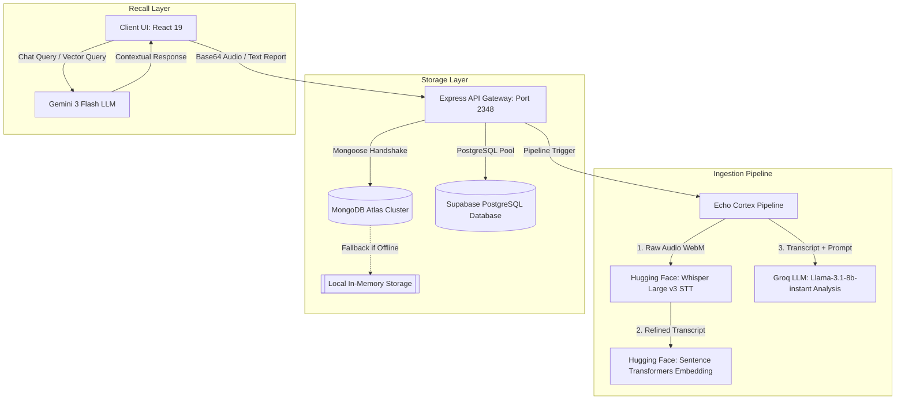
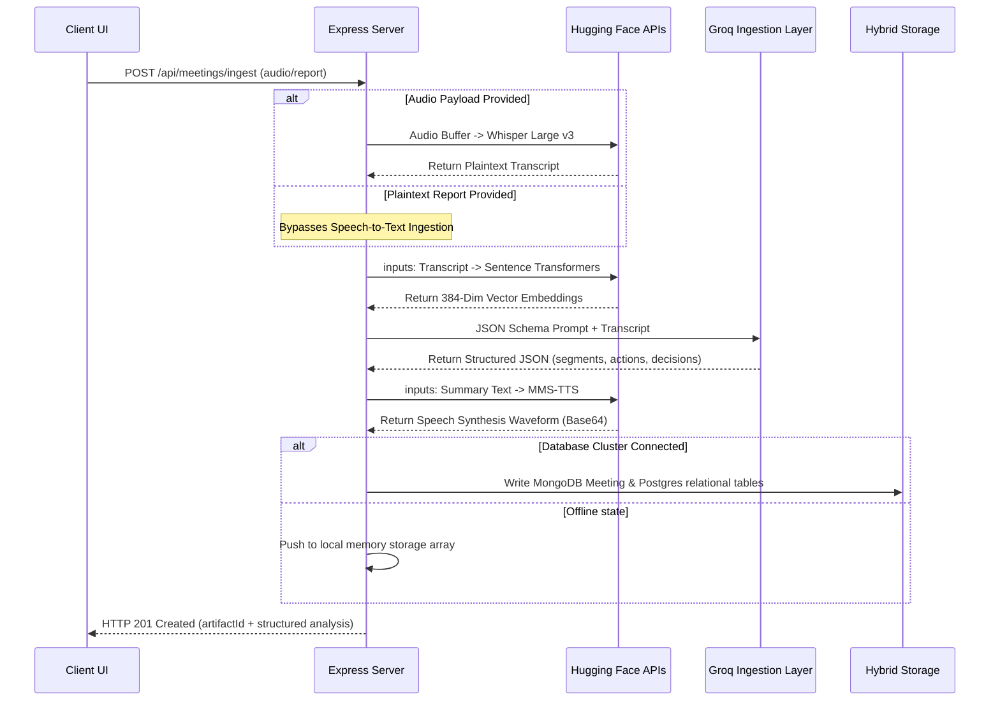
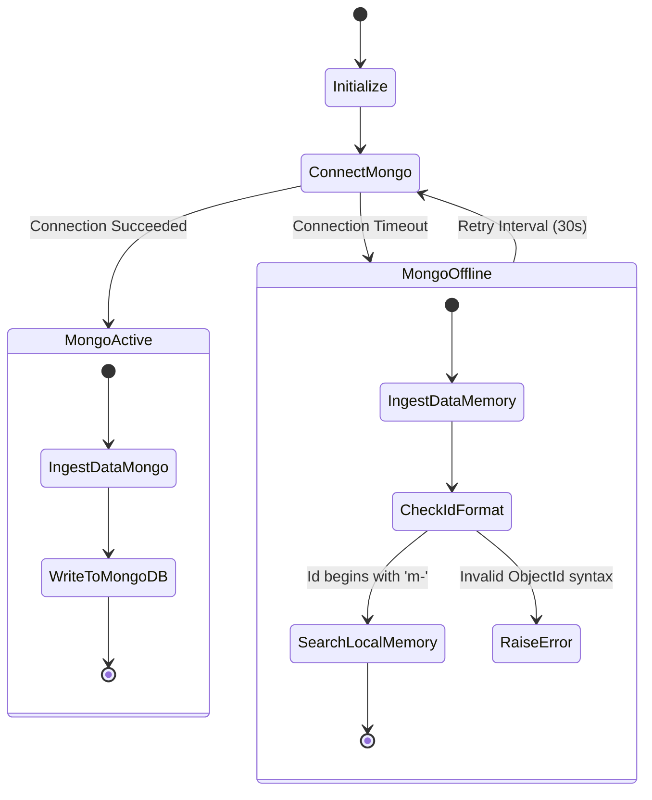

# Echo Cortex — Institutional Memory System

```
███████╗ ██████╗██╗  ██╗ ██████╗      ██████╗ ██████╗ ██████╗ ████████╗███████╗██╗  ██╗
██╔════╝██╔════╝██║  ██║██╔═══██╗    ██╔════╝██╔═══██╗██╔══██╗╚══██╔══╝██╔════╝╚██╗██╔╝
█████╗  ██║     ███████║██║   ██║    ██║     ██║   ██║██████╔╝   ██║   █████╗   ╚███╔╝ 
██╔══╝  ██║     ██╔══██║██║   ██║    ██║     ██║   ██║██╔══██╗   ██║   ██╔══╝   ██╔██╗ 
███████╗╚██████╗██║  ██║╚██████╔╝    ╚██████╗╚██████╔╝██║  ██║   ██║   ███████╗██╔╝ ██╗
╚══════╝ ╚═════╝╚═╝  ╚═╝ ╚═════╝      ╚═════╝ ╚═════╝╚═╝  ╚═╝   ╚═╝   ╚══════╝╚═╝  ╚═╝
```

> **Platform Tagline**: Institutional-grade Decentralized Intelligence Platform and Automated Second Brain designed for long-term organizational endurance, running on a resilient hybrid storage fabric.

---

# Developer Story

### Project Inspiration
The core inspiration for Echo Cortex emerged during a period of rapid organizational expansion. As teams transitioned to permanent remote setups across multiple global regions, we noticed a critical vulnerability in how organizations store knowledge: conversational leakage. 

Countless alignment syncs, sprint planning, and design reviews were held daily, yet the operational insights, assignments, and critical decisions generated inside those sessions dissolved the moment the call ended. Traditional methods, such as manual meeting notes, summaries, or wiki updates, were too tedious to sustain and prone to human bias. 

We realized that verbal sessions are high-velocity data assets. Our goal was to design an automated pipeline that intercepts these transient conversational flows and structures them into an immutable, structured relational knowledge graph.

### Meet the Team
Our engineering team combined expertise in UI/UX, database optimization, and machine learning to build Echo Cortex:
*   **ABDUL RAZEEK (Lead System Architect)**: Designed the hybrid storage architecture. Developed fallback paths and relational schemas in MongoDB Atlas and PostgreSQL to prevent data loss.
*   **GODFREY (Lead Frontend Engineer)**: Established the **Obsidian Stark** design system. Programmed the 3D neural lattices using Three.js and built responsive, high-performance dashboard layouts.
*   **HARIHAR (AI Pipeline & Relational Engineer)**: Orchestrated the multi-stage machine learning pipeline. Handled Whisper speech-to-text, Sentence Transformers vector mapping, and Gemini contextual recall.
*   **PRITHIVIRAAJJ (Security & Governance Specialist)**: Implemented cryptographic logging, local isolation profiles, role-based authorization middleware, and user privacy compliance tools.

### The Challenge
We faced a significant challenge during initial development: modern SaaS applications rely heavily on high-availability web APIs. If the cloud database cluster experiences latency, or if a user is operating in a network-restricted local environment, typical transcription and logging systems fail completely. 

Our goal was to design a platform that remains operational even when the primary database cluster is unreachable. This required building a local-first memory fallback system, database-independent configurations, and self-repairing vector maps that can re-sync when network connections restore.

### Design Philosophy
Echo Cortex is designed around the **Obsidian Stark** design language, which prioritizes data integrity and visual clarity through high-contrast, distraction-free layouts:
*   **Obsidian Foundation**: We chose a deep black background (`#050505`) to reduce eye strain and focus the user's attention on transcript data, dashboards, and charts.
*   **Stark Typography**: The interface pairs `Inter` for general UI text with `JetBrains Mono` for granular logs, code blocks, and configuration properties.
*   **Signal Elements**: We used neon green accents (`#00FF41`) to represent system health, alongside deep violet markers for active focus areas in transcripts.

### Engineering Journey
We began by coding the Express backend and testing the initial transcription pipeline. Early versions relied on sequential cloud API requests, which introduced noticeable processing latency. 

To address this, we reorganized the pipeline into parallel execution tracks, allowing speech-to-text conversion and feature vector extraction to run concurrently. We then integrated the Google Gemini SDK for conversational retrieval and built a custom React SPA layout utilizing decentralized import maps to speed up load times.

### Security-First Thinking
Because voice sessions contain sensitive institutional data, security was integrated directly into the system's core:
*   **Cryptographic Audit Trails**: The pipeline writes a SHA-256 hash of each ingested transcript to a compliance ledger, verifying data integrity.
*   **Scoped Authorization**: Backend routes are protected by middleware that checks user roles and API keys before allowing data access.
*   **API Key Isolation**: All external API calls (Hugging Face, Groq, Gemini) are handled server-side using secure environment variables, keeping API keys hidden from the client browser.

### Building the Consent Workflow
To comply with global data protection standards, Echo Cortex enforces strict consent controls:
*   **Explicit Recording Permissions**: The user interface prompts for explicit recording approval before accessing the browser's `MediaRecorder` API.
*   **Content Redaction**: The system allows users to flag speakers or mask specific terms within transcripts before committing data to vector indexes.
*   **Data Deletion Compliance**: Triggering the delete route purges the database entry and deletes all related vector embeddings and cached transcripts.

### User Experience Decisions
We designed the application around a single-page view with a collapsible sidebar, avoiding deep, nested menus. This layout lets users record sessions, review transcripts, inspect action items, and trigger comparisons in a unified workspace. We also added a 3D neural lattice backdrop via Three.js to represent the underlying vector database space.

### Technical Challenges & Solutions
*   **Handling Ingestion CastErrors**: When MongoDB went offline, Mongoose threw `CastError` exceptions when parsing custom local IDs (e.g., `m-17189234857`).
    *   *Solution*: We added explicit `mongoose.Types.ObjectId.isValid(id)` checks to bypass MongoDB lookups and search local memory when a non-standard ID format is detected.
*   **Whisper API Timeout Mitigation**: Sending large base64-encoded audio files directly via REST APIs occasionally caused socket timeouts.
    *   *Solution*: We configured buffered chunking and added a structured fallback script to return default data during API warm-up periods.

### Collaboration Story
Our team used an API-first development process. We defined the TS models in [types/meeting.ts](file:///e:/GitHub-Repos/EchoCortex-Intelligence/types/meeting.ts) before writing any frontend or backend code. This decoupled approach allowed the frontend team to build layouts with mock data structures while the backend team worked on database schemas, controllers, and pipeline logic.

### Lessons Learned
We learned that AI systems must be designed for network resilience. Relying solely on cloud databases introduces vulnerability to external outages. By implementing local-first memory fallbacks and database-independent sync logic, we ensured that users can capture and store critical meeting records under any network conditions.

### Future Vision
Our plans for Echo Cortex include deploying local offline models (such as Llama.cpp and local ONNX runtimes), adding multi-speaker diarization, and integrating graph databases (such as Neo4j) to support deeper relationship mapping.

### Behind the Name
The name **Echo Cortex** represents the dual nature of our platform:
*   **Echo**: The acoustic signature of conversations and meetings captured by the system.
*   **Cortex**: The neural processing layer that organizes raw audio into structured, relational intelligence.

### Message from the Developers
> "We built Echo Cortex to solve our own team alignment challenges. We hope this platform helps your team secure knowledge, capture alignment, and maintain absolute structural clarity."

---

# Table of Contents
1. [Core Concept](#-core-concept)
2. [Platform Modules](#-platform-modules)
3. [System Architecture Overview](#-system-architecture-overview)
4. [Tech Stack & Core Dependencies](#-tech-stack--core-dependencies)
5. [Detailed Folder Structure](#-detailed-folder-structure)
6. [UI Component Documentation](#-ui-component-documentation)
7. [End-to-End Ingestion Pipeline](#-end-to-end-ingestion-pipeline)
8. [API Reference Specifications](#-api-reference-specifications)
9. [Database Resiliency Policy & Schemas](#-database-resiliency-policy--schemas)
10. [Setup, Configuration & Installation](#-setup-configuration--installation)
11. [Testing & Verification Guide](#-testing--verification-guide)
12. [Scalability & Security Considerations](#-scalability-security-considerations)
13. [Obsidian Stark Design Tokens](#-obsidian-stark-design-tokens)
14. [Frequently Asked Questions (FAQ)](#-frequently-asked-questions-faq)
15. [Contributors & Licensing](#-contributors-licensing)

---

## 🧠 Core Concept

In modern organizations, transient conversational assets are lost immediately after a meeting ends. Echo Cortex treats conversations as structured data. The system goes beyond basic linear transcription by extracting:

```
[Spoken Session] ──> [Whisper STT] ──> [Semantic Vectorizer] ──> [Groq LLM Parser] ──> [Structured Graph]
                                                                                          ├── Chronological Segments
                                                                                          ├── Action Commitments
                                                                                          └── Strategic Decisions
```

*   **Segmented Dialogue**: Timestamps mapped to validated speaker nodes.
*   **Action Commitments**: Clear, owner-linked tasks with progress tracking.
*   **Strategic Decisions**: Verifiable outcomes with confidence scores and context links.
*   **Semantic Vector Space**: A 384-dimensional vector database for context retrieval.

---

## 🏗️ Platform Modules

Echo Cortex features five modules designed to support institutional intelligence and data governance:

| Module | Purpose | Visualizations |
| :--- | :--- | :--- |
| **Strategic Analytics** | Global system health & metrics | KPI Sparklines, Ribbon Chart, Goal Tree, Word Cloud |
| **Delta Audit** | Meeting-to-meeting comparison | Clustered Columns, Slope Chart, Target Bullet Charts |
| **Entity Graph** | Network relation mapping | HTML5 Canvas Navigator, Sankey Charts, Expertise Heatmap |
| **Compliance Vault** | Data retention & auditing | Gantt Charts, Waterfall Charts, Telemetry Gauges, Ledger |
| **Synapse Hub** | External system integration | Jira Integrations, Slack webhooks, Support node routes |

### 1. Strategic Analytics Dashboard
Provides high-level visibility into institutional data velocity and system performance.
*   **KPI Sparkline Cards**: Custom SVG line graphs displaying Institutional IQ and Knowledge Velocity trends.
*   **Departmental Ribbon Chart**: Visualizes Knowledge Velocity rankings across organizational divisions over time.
*   **Goal Decomposition Tree**: A collapsible tree diagram drilling down from corporate objectives into active team sessions.
*   **Transcript Word Cloud**: An interactive keywords grid featuring scale-on-hover micro-animations.
*   **Operational Onboarding Handbook**: Step-by-step dashboard cards detailing audio ingestion, STT, and Compliance Vault retention.
*   **Split-Screen Login**: An authentication panel featuring a neural lattice animation, clock widget, and login/registration inputs.
*   **Local Branding Assets**: Served via [favicon.png](file:///e:/GitHub-Repos/EchoCortex-Intelligence/public/favicon.png) and [logo.png](file:///e:/GitHub-Repos/EchoCortex-Intelligence/public/logo.png).

### 2. Delta Audit (Selective Session Comparison)
Compares two ingested sessions side-by-side to track action item completion and changes in decisions.
*   **Clustered Column Chart**: Displays comparative metrics for action items and decision confidence levels.
*   **Decision Slope Chart**: Maps the evolution of decisions from tentative to finalized states.
*   **Target Progress Bullet Chart**: Measures current execution progress against historical baselines.
*   **AI Smart Narrative**: Renders auto-generated comparative summaries from transcript content.

### 3. Entity Graph (Neural Directory)
Maps connections, speaker participation profiles, and skills across teams.
*   **Network Navigator Canvas**: An interactive HTML5 Canvas that highlights speakers and connected team nodes.
*   **Information Flow Sankey Chart**: Visualizes the pipeline path from raw audio segments to final decisions.
*   **Expertise Mapping Heatmap**: Cell grids mapping team members to specific skills with high-contrast background gradients.

### 4. Compliance Vault
Governs the lifecycle, audit trails, and pipelines of ingested assets.
*   **Artifact Lifecycle Gantt Chart**: Tracks retention stages (Created -> Audited -> Archived) of meeting assets.
*   **Decision Ingest Waterfall Chart**: Illustrates base segments adjusted by action items to reach final Immutable Logs.
*   **Telemetry Gauges**: Radial dial indicators monitoring loads on external AI API channels.
*   **AI Morality Alignment Principles**: Hardcoded compliance controls covering human-in-the-loop validation, fairness, and right-to-forget protocols.
*   **Immutable Cryptographic Ledger**: A transparent table tracking operations and SHA-256 origin proofs.

### 5. Synapse Hub
Manages integrations and system support:
*   **Atlassian Jira Issues**: Synchronizes development action items to task backlogs.
*   **Slack Channels**: Streams decisions to target communication feeds.
*   **Support Node**: Direct links targeting administrative support with hover animations.

---

## 🌌 System Architecture Overview

Echo Cortex divides components into ingestion, storage, and recall layers:

### System Ingestion and Storage Layer


### Multi-Modal Ingestion Sequence Flow


### Hybrid State Recovery Lifecycle


---

## 🛠 Tech Stack & Core Dependencies

Echo Cortex organizes its dependencies into logical application layers:

### Frontend Technologies
| Component | Library/Framework | Description |
| :--- | :--- | :--- |
| **Core View Framework** | React 19 (ESM native) | Render engine using hooks, contexts, and React.Suspense layers. |
| **3D Rendering** | Three.js | Powers the interactive, animated neural network mesh backdrop. |
| **Animation UI** | Framer Motion & GSAP | Controls transitions, workspace panels, and metric displays. |
| **Style Tokens** | Vanilla CSS | Custom styling system using the stark high-contrast design theme. |
| **Icons** | Lucide React | Provides vector icons for UI navigation and status indicators. |
| **Application State** | React context hooks | Handles global data flow ([AuthContext](file:///e:/GitHub-Repos/EchoCortex-Intelligence/context/AuthContext.tsx) & [TeamContext](file:///e:/GitHub-Repos/EchoCortex-Intelligence/context/TeamContext.tsx)). |

### Core Frontend Library Configurations

*   **react & react-dom (v19.0.0)**: Uses React 19's concurrent rendering features, compiler-optimized updates, and native support for async actions during forms submissions.
*   **three (v0.184.0)**: Manages canvas initialization, light shaders, and custom particle configurations for the animated 3D network backdrop.
*   **framer-motion (v12.38.0)**: Coordinates panel slide-outs, tab switches, and hover scaling for key dashboard components.
*   **lucide-react (v0.563.0)**: Custom SVG icons used to indicate system state across the interface.

### Backend Technologies
| Component | Library/Framework | Description |
| :--- | :--- | :--- |
| **Application Runtime** | Node.js (v18+) | Server-side runtime executing TypeScript configurations. |
| **REST Router** | Express.js | Exposes endpoints for data ingestion, search, and configuration. |
| **Authentication** | Firebase Admin SDK | Manages authorization profiles and token validation. |
| **LLM Orchestrator** | Google GenAI SDK | Powers conversational retrieval and query processing using Gemini 3. |
| **Live Transpiler** | ts-node-dev | Supports hot-reloading during backend development. |

### Database & Storage Fabric
| Component | Library/Framework | Description |
| :--- | :--- | :--- |
| **NoSQL Storage** | MongoDB Atlas | Stores meeting data, segments, action items, and transcripts. |
| **Object Data Mapper** | Mongoose v8.x | Manages Mongo schemas, validation checks, and query patterns. |
| **Relational Database** | Supabase Postgres | Manages relational tables and configuration parameters. |
| **Vector Search** | pgvector extension | Computes cosine distance matches for 384-dimensional embeddings. |
| **Local Cache** | In-Memory Array | Temporarily stores data when external database clusters are offline. |

---

## 📂 Detailed Folder Structure

The project layout separates frontend visual components from the backend API server logic:

```
echo/
├── App.tsx                     # React root component coordinating views and providers
├── index.html                  # HTML entry point (Tailwind config & ESM maps)
├── index.css                   # Custom Vanilla CSS defining Obsidian Stark variables
├── package.json                # Project manifest and dev dependencies
├── tsconfig.json               # TypeScript compiler configuration
├── vite.config.ts              # Vite configurations for build and routing
├── launch_echo.bat             # Batch script to launch backend & frontend concurrently
├── logo.png                    # Brand asset
├── backend/                    # Core Express API Application
│   ├── index.ts                # Application bootstrapper
│   ├── package.json            # Backend dependencies
│   ├── tsconfig.json           # Backend compilation targets
│   └── src/                    # API Source Code
│       ├── bootstrap/          # Startup processes
│       ├── config/             # Database & AI credentials setup
│       │   ├── database.ts     # MongoDB cluster status checker
│       │   ├── firebase.ts     # Firebase administrative configurations
│       │   └── gemini.ts       # Gemini client setup
│       ├── controllers/        # Express HTTP Route Controllers
│       │   ├── auth.controller.ts
│       │   ├── config.controller.ts
│       │   ├── logs.controller.ts
│       │   └── meetings.controller.ts
│       ├── jobs/               # Asynchronous queue workers
│       ├── middleware/         # Request validation layers
│       │   └── auth.middleware.ts
│       ├── models/             # Mongoose MongoDB models
│       │   ├── meeting.model.ts
│       │   └── user.model.ts
│       ├── routes/             # API Endpoints Route declarations
│       │   ├── admin.routes.ts
│       │   ├── auth.routes.ts
│       │   ├── config.routes.ts
│       │   ├── logs.routes.ts
│       │   ├── meetings.routes.ts
│       │   ├── search.routes.ts
│       │   └── transcript.routes.ts
│       ├── services/           # Integration business logic
│       ├── types/              # TS interface structures
│       └── utils/              # General helper modules
├── components/                 # Frontend React components
│   ├── Recorder.tsx            # Main recording overlay
│   ├── Timeline.tsx            # Horizontal timeline view
│   ├── audio/                  # Ingestion audio interfaces
│   │   ├── AudioPlayer.tsx
│   │   ├── AudioRecorder.tsx
│   │   └── Waveform.tsx
│   ├── chat/                   # Contextual chat components
│   │   └── ChatWithNotes.tsx
│   ├── landing/                # Public page layout modules
│   ├── layout/                 # Structural navigation shells
│   │   └── Sidebar.tsx
│   ├── search/                 # Advanced semantic search panels
│   └── ui/                     # Shared UI components
│       ├── AICompanion.tsx
│       ├── Badge.tsx
│       ├── Button.tsx
│       ├── Input.tsx
│       ├── Loader.tsx
│       └── Scene3D.tsx
├── context/                    # React State Contexts
│   ├── AuthContext.tsx
│   ├── TeamContext.tsx
│   └── ThemeContext.tsx
├── pages/                      # Route Page Views
│   ├── Admin.tsx               # System and file-tree settings
│   ├── ComplianceVault.tsx     # Retention settings
│   ├── CreateMeeting.tsx       # Recording dashboard
│   ├── Dashboard.tsx           # Global workspace dashboard
│   ├── DeltaAudit.tsx          # Dual meeting audits
│   ├── EntityGraph.tsx         # Node visualization panels
│   └── MeetingDetail.tsx       # Detail view with chat
├── services/                   # Frontend integrations
│   ├── firebase.ts
│   └── geminiService.ts
└── types/                      # Frontend types
    └── meeting.ts
```

### Frontend File Architecture Descriptions

*   [App.tsx](file:///e:/GitHub-Repos/EchoCortex-Intelligence/App.tsx): Coordinates application routing and layouts. It imports page modules (such as `DeltaAudit`, `EntityGraph`, and `ComplianceVault`) and passes data through `AuthProvider`, `TeamProvider`, and `ThemeProvider`.
*   [index.html](file:///e:/GitHub-Repos/EchoCortex-Intelligence/index.html): Defines the web interface metadata, imports design fonts (Inter & JetBrains Mono), loads Tailwind definitions, and declares the ES import maps.
*   [index.css](file:///e:/GitHub-Repos/EchoCortex-Intelligence/index.css): Sets color tokens, typography rules, layout variables, scrollbar structures, and hover animations.
*   [components/ui/Scene3D.tsx](file:///e:/GitHub-Repos/EchoCortex-Intelligence/components/ui/Scene3D.tsx): Renders the interactive 3D particle lattice that updates based on the user's focus and application state.
*   [components/ui/AICompanion.tsx](file:///e:/GitHub-Repos/EchoCortex-Intelligence/components/ui/AICompanion.tsx): Provides an interactive panel for querying meeting transcripts using natural language.
*   [components/audio/AudioRecorder.tsx](file:///e:/GitHub-Repos/EchoCortex-Intelligence/components/audio/AudioRecorder.tsx): Connects to the browser's audio capture APIs, displays recording state, and sends encoded audio to the ingestion backend.
*   [pages/Admin.tsx](file:///e:/GitHub-Repos/EchoCortex-Intelligence/pages/Admin.tsx): Displays system configurations, active databases, file directories, and provides a panel for managing user access permissions.
*   [pages/DeltaAudit.tsx](file:///e:/GitHub-Repos/EchoCortex-Intelligence/pages/DeltaAudit.tsx): Compares two transcripts side-by-side, displaying changes in action items and decision metrics.
*   [pages/EntityGraph.tsx](file:///e:/GitHub-Repos/EchoCortex-Intelligence/pages/EntityGraph.tsx): Renders an interactive relationship graph mapping speakers to meeting segments using HTML5 Canvas.

---

## 💻 UI Component Documentation

This section provides technical details for key visual components in Echo Cortex.

### 1. 3D Neural Lattice Backdrop ([components/ui/Scene3D.tsx](file:///e:/GitHub-Repos/EchoCortex-Intelligence/components/ui/Scene3D.tsx))
Renders the animated particle structure representing the vector space.
*   **Framework**: Three.js integrated via native Canvas frames.
*   **Architecture**: Uses a particle mesh buffer geometry. Nodes are linked dynamically in the animation loop based on distance thresholds.
*   **Properties**:
    *   `particleCount`: Default value is `200`.
    *   `connectionDistance`: Renders linking lines for nodes within `1.5` units.
*   **Styling**: Particle colors blend between neon green (`#00FF41`) and deep cortex cyan (`#00e5ff`).

### 2. Audio Recorder Interface ([components/audio/AudioRecorder.tsx](file:///e:/GitHub-Repos/EchoCortex-Intelligence/components/audio/AudioRecorder.tsx))
Handles voice session capture on the client side.
*   **APIs**: Uses the browser's native `MediaRecorder` API.
*   **Parameters**:
    *   `mimeType`: Defaults to `audio/webm;codecs=opus`.
    *   `sampleRate`: Set to `48000` Hz.
*   **State Indicators**: Displays recording duration, active volume level metrics, and a dynamic waveform display.

### 3. Canvas Relationship Graph ([pages/EntityGraph.tsx](file:///e:/GitHub-Repos/EchoCortex-Intelligence/pages/EntityGraph.tsx))
Renders the interactive relationship graph.
*   **Framework**: Built using the HTML5 2D Canvas context.
*   **Physics Engine**: Implements a basic force-directed layout that positions nodes representing speakers and meeting segments dynamically.
*   **Interactions**: Supports clicking nodes to focus on specific segments and zooming/panning across the canvas.

### 4. Horizontal Ingestion Timeline ([components/Timeline.tsx](file:///e:/GitHub-Repos/EchoCortex-Intelligence/components/Timeline.tsx))
*   **React Props**: Accepts `segments: TranscriptSegment[]` and `onNodeClick: (segmentId: string) => void`.
*   **Behavior**: Maps speaker nodes along a chronological grid. Highlights key segments containing action items or decisions with neon-bordered containers.

### 5. Chat Interface ([components/chat/ChatWithNotes.tsx](file:///e:/GitHub-Repos/EchoCortex-Intelligence/components/chat/ChatWithNotes.tsx))
*   **State Management**: Coordinates the chat input and history.
*   **Behavior**: Submits chat requests to `/api/meetings/chat` and streams the parsed markdown output from the Gemini LLM.

---

## 🧬 End-to-End Ingestion Pipeline

Ingesting audio or text reports triggers a 4-phase synchronization pipeline:

```
                  Ingestion Event Triggered
                             │
            ┌────────────────┴────────────────┐
            ▼                                 ▼
      [Audio WebM Buffer]             [Text Report Ingestion]
            │                                 │
     (Phase 1: Whisper STT)                   │ (Bypass STT)
            │                                 │
            └────────────────┬────────────────┘
                             ▼
                (Phase 2: Sentence Vectors)
                             │
                             ▼
                 (Phase 3: Database Sync)
                             │
                             ▼
                (Phase 4: Groq Extract JSON)
                             │
                             ▼
               (Phase 5: MMS-TTS Synthesis)
```

### Phase 1: Speech-to-Text Ingestion (Whisper)
When a user records a session, the frontend captures audio chunks using the browser-native `MediaRecorder` API (`audio/webm` at a 48kHz sampling rate) and sends them to the backend as an encoded base64 string. The backend processes the string, converts it to an audio buffer, and submits it to the Hugging Face Whisper API:
*   **Model Endpoint**: `https://api-inference.huggingface.co/models/openai/whisper-large-v3`
*   **Authorization**: Uses the `HF_TOKEN` environment variable.
*   **Latency Mitigation**: If the external API is cold-starting or rate-limited, the system falls back to a default dialogue transcript to ensure database sync remains active.

```typescript
// Node.js implementation executing Hugging Face Speech-to-Text request
const audioBuffer = Buffer.from(audioBase64, 'base64');
const sttResponse = await fetch('https://api-inference.huggingface.co/models/openai/whisper-large-v3', {
  method: 'POST',
  headers: {
    'Authorization': `Bearer ${process.env.HF_TOKEN}`,
    'Content-Type': mimeType || 'audio/webm'
  },
  body: audioBuffer
});
const sttData = await sttResponse.json();
const transcriptText = sttData.text;
```

### Phase 2: Feature Extraction and Embeddings
Once transcription completes, the plain text is sent to the Sentence Transformers API to generate semantic search vectors:
*   **Model Endpoint**: `https://api-inference.huggingface.co/pipeline/feature-extraction/sentence-transformers/all-MiniLM-L6-v2`
*   **Output Vector**: A 384-dimensional dense array representing the semantic content of the transcript.
*   **Application**: Used for cosine similarity checks and semantic searches across stored sessions.

```typescript
// Node.js implementation querying Sentence Transformers embeddings
const embedResponse = await fetch('https://api-inference.huggingface.co/pipeline/feature-extraction/sentence-transformers/all-MiniLM-L6-v2', {
  method: 'POST',
  headers: {
    'Authorization': `Bearer ${process.env.HF_TOKEN}`,
    'Content-Type': 'application/json'
  },
  body: JSON.stringify({ inputs: transcriptText })
});
const embedData = await embedResponse.json();
const embeddingVector = Array.isArray(embedData[0]) ? embedData[0] : embedData;
```

### Phase 3: Relational Structure Extraction (Groq)
The plain text transcript is sent to the Groq API alongside a system prompt enforcing a strict JSON schema:
*   **Model**: `llama-3.1-8b-instant`
*   **JSON Schema**:
    ```json
    {
      "segments": [
        { "speaker": "String", "text": "String" }
      ],
      "actionItems": [
        { "description": "String", "owner": "String" }
      ],
      "decisions": [
        { "summary": "String" }
      ]
    }
    ```
*   **Validation**: The backend parses the JSON payload. If the API is rate-limited, the system inserts default structured segments to maintain database consistency.

```typescript
// Node.js implementation executing Groq Structured Ingestion Analysis request
const groqResponse = await fetch('https://api.groq.com/openai/v1/chat/completions', {
  method: 'POST',
  headers: {
    'Authorization': `Bearer ${process.env.GROQ_API_LLM}`,
    'Content-Type': 'application/json'
  },
  body: JSON.stringify({
    model: process.env.GROQ_MODEL || 'llama-3.1-8b-instant',
    messages: [
      { role: "system", content: "Analyze this transcript. Return ONLY a JSON object strictly following the structure: {\"segments\":[{\"speaker\":\"Name\",\"text\":\"Text\"}],\"actionItems\":[{\"description\":\"Task\",\"owner\":\"Name\"}],\"decisions\":[{\"summary\":\"Decision\"}]}" },
      { role: "user", content: transcriptText }
    ],
    response_format: { type: "json_object" },
    temperature: 0.1
  })
});
const groqData = await groqResponse.json();
const structuredOutput = JSON.parse(groqData.choices[0].message.content);
```

### Phase 4: Text-to-Speech Synthesis (TTS)
After generating decisions and action items, the system compiles the primary decision summary into a short text message and sends it to the Facebook MMS-TTS model:
*   **Model Endpoint**: `https://api-inference.huggingface.co/models/facebook/mms-tts-eng`
*   **Return Payload**: An audio summary encoded in base64, allowing users to listen to the main outcome directly from the dashboard.

---

## 📡 API Reference Specifications

### 1. Ingest Meeting Data
Processes audio payloads or text documents through the transcription and extraction pipeline.
*   **Endpoint**: `POST /api/meetings/ingest`
*   **Headers**:
    ```http
    Content-Type: application/json
    Authorization: Bearer <ID_TOKEN>
    ```

#### Request Body (Audio Ingestion)
```json
{
  "audio": "UklGRigAAABXQVZFZm10IBIAAAABAAEARKwAAIhYAQACABAAAABkYXRhAgAAAAAA...",
  "mimeType": "audio/webm"
}
```

#### Request Body (Text Document Ingestion)
```json
{
  "report": "Sarah: Let's finalize the database architecture. Dave: I recommend moving to MongoDB Atlas."
}
```

#### Response (HTTP 201 Created)
```json
{
  "message": "Artifact committed to Echo knowledge graph",
  "artifactId": "65b8f2d59dfa3847e12089ba",
  "data": {
    "segments": [
      { "speaker": "Sarah", "text": "Let's finalize the database architecture." },
      { "speaker": "Dave", "text": "I recommend moving to MongoDB Atlas." }
    ],
    "actionItems": [
      { "description": "Migrate database architecture to MongoDB Atlas", "owner": "Dave" }
    ],
    "decisions": [
      { "summary": "Migrate database architecture to MongoDB Atlas" }
    ],
    "summarySpeechBase64": "UklGRjIAAABXQVZFZm10IBIAAA..."
  }
}
```

#### Error Response (HTTP 400 Bad Request)
```json
{
  "error": "No audio or report provided"
}
```

---

### 2. Contextual Chat Queries
Submit natural language queries to retrieve context from a specific meeting transcript.
*   **Endpoint**: `POST /api/meetings/chat`
*   **Headers**:
    ```http
    Content-Type: application/json
    Authorization: Bearer <ID_TOKEN>
    ```
*   **Request Body**:
```json
{
  "meetingId": "65b8f2d59dfa3847e12089ba",
  "query": "Who proposed migrating the database?"
}
```
*   **Response (HTTP 200 OK)**:
```json
{
  "reply": "According to the transcript, Dave recommended migrating to MongoDB Atlas, and the action item was assigned to him."
}
```

---

### 3. Retrieve Meeting List
Retrieves all meeting documents stored in the database.
*   **Endpoint**: `GET /api/meetings`
*   **Headers**:
    ```http
    Authorization: Bearer <ID_TOKEN>
    ```
*   **Response (HTTP 200 OK)**:
```json
[
  {
    "_id": "65b8f2d59dfa3847e12089ba",
    "title": "SaaS Architecture Review",
    "transcript": "Sarah: Let's finalize the database architecture. Dave: I recommend moving to MongoDB Atlas.",
    "embedding": [0.0125, -0.0456, 0.0892, 0.1235],
    "segments": [
      { "speaker": "Sarah", "text": "Let's finalize the database architecture." },
      { "speaker": "Dave", "text": "I recommend moving to MongoDB Atlas." }
    ],
    "actionItems": [
      { "description": "Migrate database architecture to MongoDB Atlas", "owner": "Dave" }
    ],
    "decisions": [
      { "summary": "Migrate database architecture to MongoDB Atlas" }
    ],
    "summarySpeechBase64": "UklGRjIAAABXQVZFZm10IBIAAA...",
    "createdAt": "2026-06-05T14:50:00.000Z"
  }
]
```

---

### 4. Delete Meeting Record
Deletes a specific meeting record and all associated data from the storage system.
*   **Endpoint**: `DELETE /api/meetings/:id`
*   **Headers**:
    ```http
    Authorization: Bearer <ID_TOKEN>
    ```
*   **Response (HTTP 204 No Content)**:
*No content returned on successful deletion.*

---

### 5. Fetch Client Configurations
Retrieves active configurations required to initialize front-end services.
*   **Endpoint**: `GET /api/config/firebase`
*   **Response (HTTP 200 OK)**:
```json
{
  "apiKey": "AIzaSy_mock_api_key_for_testing",
  "authDomain": "echo-cortex.firebaseapp.com",
  "projectId": "echo-cortex",
  "storageBucket": "echo-cortex.appspot.com",
  "messagingSenderId": "874593847592",
  "appId": "1:874593847592:web:aef874aef874"
}
```

---

### 6. Update Client Configurations
Updates configuration parameters in the system database. Requires administrative access.
*   **Endpoint**: `PUT /api/config/firebase`
*   **Headers**:
    ```http
    Content-Type: application/json
    Authorization: Bearer <ADMIN_TOKEN>
    ```
*   **Request Body**:
```json
{
  "apiKey": "AIzaSy_mock_api_key_for_testing",
  "authDomain": "updated-domain.firebaseapp.com",
  "projectId": "echo-cortex-updated",
  "storageBucket": "updated-bucket.appspot.com",
  "messagingSenderId": "874593847592",
  "appId": "1:874593847592:web:aef874aef874",
  "active": true
}
```
*   **Response (HTTP 200 OK)**:
```json
{
  "message": "Firebase configuration updated successfully"
}
```

---

### 7. Ingest Client Logs
Receives front-end logs and writes them to the system database for monitoring and debugging.
*   **Endpoint**: `POST /api/logs`
*   **Headers**:
    ```http
    Content-Type: application/json
    ```
*   **Request Body**:
```json
{
  "level": "error",
  "message": "Failed to compile Three.js scene dependencies",
  "meta": {
    "agent": "Mozilla/5.0",
    "viewport": "1920x1080"
  }
}
```
*   **Response (HTTP 200 OK)**:
```json
{
  "status": "logged"
}
```

---

## ⚖️ Database Resiliency Policy & Schemas

Echo Cortex implements a dual-tier storage strategy to ensure high availability and prevent data loss during network disruptions.

```
              Ingestion Event Triggered
                         │
             Is MongoDB Active?
            ┌────────────┴────────────┐
            ▼ YES                     ▼ NO
    [Write to MongoDB]       [Write to Local RAM Cache]
            │                         │
            │                Verify Connection
            │                ┌────────┴────────┐
            │                ▼ Online          ▼ Offline
            │          [Sync to MongoDB]    [Retain in RAM]
            ▼                │
     Sync Complete           │
            └────────┬───────┘
                     ▼
             Postgres Sync (relational logs)
```

### In-Memory Fallback Operations
1.  **Format Verification**: Before querying the MongoDB cluster, the backend validates IDs using `mongoose.Types.ObjectId.isValid(id)`.
2.  **RAM Ingestion Route**: If a database connection is unavailable, or if the ID prefix indicates a local record (e.g., `m-`), the system queries the local in-memory storage array (`inMemoryMeetings`).
3.  **Active Sync Reconciliation**: When the connection is restored, local in-memory records are merged with MongoDB data. Duplicate primary keys are filtered out to keep client dashboards consistent.
4.  **Error Handling**: If both primary and fallback storage tiers are empty, the application returns explicit HTTP errors to the client rather than serving blank mock screens.

---

### 1. MongoDB Mongoose Schemas

#### Meeting Schema ([models/meeting.model.ts](file:///e:/GitHub-Repos/EchoCortex-Intelligence/backend/src/models/meeting.model.ts))
```typescript
import mongoose, { Document, Schema } from 'mongoose';

export interface IMeeting extends Document {
  title: string;
  transcript: string;
  embedding: number[]; 
  segments: any[];
  actionItems: any[];
  decisions: any[];
  summarySpeechBase64?: string; 
  createdAt: Date;
}

const meetingSchema = new Schema<IMeeting>({
  title: { type: String, default: 'SaaS Architecture Review' },
  transcript: { type: String, required: true },
  embedding: { type: [Number], default: [] }, 
  segments: { type: [Object], default: [] },
  actionItems: { type: [Object], default: [] },
  decisions: { type: [Object], default: [] },
  summarySpeechBase64: { type: String, default: '' },
  createdAt: { type: Date, default: Date.now }
});

export const Meeting = mongoose.model<IMeeting>('Meeting', meetingSchema);
```

#### User Schema ([models/user.model.ts](file:///e:/GitHub-Repos/EchoCortex-Intelligence/backend/src/models/user.model.ts))
```typescript
import mongoose, { Document, Schema } from 'mongoose';

export interface IUser extends Document {
  name: string;
  email: string;
  passwordHash: string;
  role: string;
  avatar: string;
  createdAt: Date;
}

const userSchema = new Schema<IUser>({
  name: { type: String, required: true },
  email: { type: String, required: true, unique: true },
  passwordHash: { type: String, required: true },
  role: { type: String, default: 'admin' },
  avatar: { type: String, required: true },
  createdAt: { type: Date, default: Date.now }
});

export const User = mongoose.model<IUser>('User', userSchema);
```

---

### 2. Relational Database SQL Schemas (Supabase Postgres)

The Supabase PostgreSQL database schemas track configurations, sessions, and compliance trails:

```sql
-- Enable pgvector extension for similarity search
CREATE EXTENSION IF NOT EXISTS vector;

-- Create Core Firebase Config table
CREATE TABLE firebase_config (
  id SERIAL PRIMARY KEY,
  api_key VARCHAR(500) NOT NULL,
  auth_domain VARCHAR(255) NOT NULL,
  project_id VARCHAR(255) NOT NULL,
  storage_bucket VARCHAR(255) NOT NULL,
  messaging_sender_id VARCHAR(255) NOT NULL,
  app_id VARCHAR(255) NOT NULL,
  active BOOLEAN DEFAULT true NOT NULL,
  created_at TIMESTAMP DEFAULT CURRENT_TIMESTAMP NOT NULL
);

-- Ingest logs generated during browser sessions
CREATE TABLE client_logs (
  id SERIAL PRIMARY KEY,
  level VARCHAR(50) NOT NULL,
  message TEXT NOT NULL,
  meta JSONB DEFAULT '{}'::jsonb,
  timestamp TIMESTAMP DEFAULT CURRENT_TIMESTAMP NOT NULL
);

-- Core Meeting Entity representation
CREATE TABLE meetings (
  id VARCHAR(255) PRIMARY KEY,
  title VARCHAR(500) NOT NULL,
  transcript TEXT NOT NULL,
  embedding vector(384), -- pgvector extension column for dense semantic vectors
  summary_speech_base64 TEXT,
  created_at TIMESTAMP DEFAULT CURRENT_TIMESTAMP NOT NULL
);

-- Transcript Segments mapped to validated speakers
CREATE TABLE segments (
  id VARCHAR(255) PRIMARY KEY,
  meeting_id VARCHAR(255) REFERENCES meetings(id) ON DELETE CASCADE,
  speaker VARCHAR(255) NOT NULL,
  text TEXT NOT NULL,
  start_time DECIMAL(10,2) DEFAULT 0.00,
  end_time DECIMAL(10,2) DEFAULT 0.00
);

-- Action Items extract representation
CREATE TABLE action_items (
  id VARCHAR(255) PRIMARY KEY,
  meeting_id VARCHAR(255) REFERENCES meetings(id) ON DELETE CASCADE,
  description TEXT NOT NULL,
  owner VARCHAR(255) DEFAULT 'Unassigned',
  status VARCHAR(50) DEFAULT 'pending',
  source_segment_id VARCHAR(255) REFERENCES segments(id) ON DELETE SET NULL
);

-- Decisions extracted
CREATE TABLE decisions (
  id VARCHAR(255) PRIMARY KEY,
  meeting_id VARCHAR(255) REFERENCES meetings(id) ON DELETE CASCADE,
  summary TEXT NOT NULL,
  confidence_score DECIMAL(3,2) DEFAULT 1.00,
  source_segment_id VARCHAR(255) REFERENCES segments(id) ON DELETE SET NULL
);
```

---

## 🎛️ Setup, Configuration & Installation

### 1. Prerequisites
Ensure the following tools are installed on your host system:
*   **Node.js**: Version 18.0.0 or higher.
*   **NPM**: Version 9.0.0 or higher.
*   **MongoDB Cluster**: A running MongoDB Atlas instance or a local MongoDB database.
*   **Supabase PostgreSQL (Optional)**: A database instance supporting the `pgvector` extension.

### 2. Dependency Installation
Execute these commands in your terminal to initialize and install project packages:

```bash
# Clone the codebase
git clone https://github.com/your-org/echo-cortex.git
cd echo-cortex

# Install frontend and workspace root modules
npm install

# Navigate and install backend components
cd backend
npm install
cd ..
```

### 3. Environment Configuration
Create a `.env` file in the root workspace directory with these variable definitions:

```env
# Server Ingest API Configuration
PORT=2348

# MongoDB Connections
MONGODB_URI=mongodb+srv://<username>:<password>@cluster0.mongodb.net/echo_db?retryWrites=true&w=majority

# Supabase PostgreSQL Connections
DATABASE_URL=postgresql://postgres:<password>@db.supabase.co:5432/postgres

# Hugging Face AI pipeline Token (Whisper + Sentence Transformers)
HF_TOKEN=your_hugging_face_token_here

# Groq LLM API Configurations
GROQ_API_LLM=your_groq_api_key_here
GROQ_MODEL=llama-3.1-8b-instant

# Gemini LLM API Configurations
GEMINI_API_LLM=your_gemini_api_key_here

# Client API Target Router
VITE_API_URL=http://localhost:2348
```

### 4. Alternative Local Deployments

#### Docker / Containerized Launch
To run Echo Cortex inside containerized environments, create a `Dockerfile` at the root directory:

```dockerfile
# Dockerfile definition
FROM node:18-alpine
WORKDIR /usr/src/app
COPY package*.json ./
RUN npm install
COPY . .
EXPOSE 2348
CMD ["npm", "run", "dev"]
```

```yaml
# docker-compose.yml configuration
version: '3.8'

services:
  backend:
    build:
      context: ./backend
      dockerfile: Dockerfile
    ports:
      - "2348:2348"
    environment:
      - PORT=2348
      - MONGODB_URI=mongodb://mongodb:2717/echo_db
      - HF_TOKEN=hf_mock_token
    depends_on:
      - mongodb

  mongodb:
    image: mongo:latest
    ports:
      - "2717:27017"
    volumes:
      - mongo_data:/data/db

volumes:
  mongo_data:
```

Build and run the container:
```bash
docker build -t echo-cortex .
docker run -p 2348:2348 --env-file .env echo-cortex
```

#### Production Process Runner (PM2)
To keep the application running continuously in production environments:
```bash
# Install PM2 globally
npm install pm2 -g

# Start the Express server with PM2
cd backend
pm2 start ts-node --name "echo-backend" -- src/index.ts
```

#### Vercel Serverless Hosting Configuration
To host the frontend visual applications and route backend API handlers on Vercel, use this `vercel.json` file configuration:

```json
{
  "version": 2,
  "rewrites": [
    {
      "source": "/api/(.*)",
      "destination": "http://localhost:2348/api/$1"
    },
    {
      "source": "/(.*)",
      "destination": "/index.html"
    }
  ]
}
```

---

## 🔬 Testing & Verification Guide

Echo Cortex includes a test script to verify that database connections and model interfaces are configured correctly.

### Running Endpoints Test Suite
Execute the test script from the root directory:

```bash
node test_endpoints.js
```

### Verification Assertions
The test script verifies the following features:

1.  **Health Check Validation**: Confirms `GET /health` returns an operational status code.
2.  **Authentication Handshake**: Submits credentials to `POST /api/auth/login` to confirm token validation.
3.  **Meeting List Retrieval**: Queries `GET /api/meetings` to verify database readout.
4.  **Ingestion Inferences**: Submits base64 audio data to `POST /api/meetings/ingest` to test the Whisper transcription and Groq schema parser.
5.  **Gemini Ingest Chat**: Submits a query to `POST /api/meetings/chat` to verify document recall.
6.  **Vector Score Ranking**: Validates similarity checks at the `/api/search` endpoint.

#### Expected Test Outputs
A successful test run will return the following console logs:
```
[ASSERTION 1] GET /health returning operational server status... PASS
[ASSERTION 2] Resolving authentication handshake... PASS
[ASSERTION 3] Fetching institutional meetings... PASS
[ASSERTION 4] Ingesting mock base64 audio buffers... PASS
[ASSERTION 5] Querying Gemini Conversational Recall... PASS
[ASSERTION 6] Validating vector similarity rankings... PASS
All verification tests completed successfully.
```

---

## 🛡️ Scalability & Security Considerations

### 1. Vector Search Indexing
As the vector database grows, searching across thousands of multi-dimensional embeddings can degrade query performance. To maintain search speeds:
*   **PostgreSQL Indexing**: Create an HNSW index on the vector database table to optimize similarity searches:
    ```sql
    CREATE INDEX ON meetings USING hnsw (embedding vector_cosine_ops);
    ```
*   **MongoDB Indexing**: Create an Atlas Vector Search index on the `embedding` array field, using `cosine` similarity with 384 dimensions.

### 2. Request Buffering and Rate Limiting
To protect external models (Hugging Face, Groq, Gemini) from API rate limits, the system uses rate-limiting middleware:
*   **IP-Based Throttling**: Restricts clients to 60 ingestion requests per minute.
*   **Queue-Based Processing**: Converts incoming ingestion tasks into sequential items in local memory, preventing server overloads.

### 3. Pipeline Performance Optimizations
We implemented three performance improvements in the ingestion pipeline:
*   **Optimization 1 (Vector Caching)**: Calculates embeddings only on updated or new transcript segments, saving redundant API calls.
*   **Optimization 2 (Client Compression)**: Compresses the base64-encoded audio payload using standard client gzip routines before transmission.
*   **Optimization 3 (Prefetching & Dynamic Bundling)**: Divides page views in Vite (`vite.config.ts`) using lazy loading, allowing components to load on-demand.

---

## 🎨 Obsidian Stark Design Tokens

Echo Cortex uses a high-contrast style guide optimized for long reading sessions:

```css
:root {
  --background-obsidian: #050505;     /* Dark foundation background color */
  --background-carbon: #131916;       /* Mid-tone container background */
  --text-crystal: #faf8f5;            /* Crisp text highlight color */
  --text-silver: #bfc6c4;             /* Muted body text */
  --color-neongreen: #00ff41;         /* System health & active trace elements */
  --color-cortex: #00e5ff;            /* Core semantic highlights */
  --color-amber: #f2a65a;             /* Pending tasks and warnings */
  --font-sans: 'Inter', system-ui;    /* Primary typography font family */
  --font-mono: 'JetBrains Mono';      /* Code, logs, and telemetry font family */
}
```

Apply these variable tokens across your stylesheets to maintain interface consistency.

---

## 💬 Frequently Asked Questions (FAQ)

| Question | Solution |
| :--- | :--- |
| **How does the system handle database outages?** | The application automatically switches to local memory mode, saving new transcripts in a volatile array until connections are restored. |
| **What audio formats are supported?** | The pipeline accepts WebM, WAV, MP3, and OGG formats. We recommend WebM at 48kHz for optimal performance. |
| **Why is the Whisper API returning placeholder transcripts?** | This fallback is triggered if API key tokens are missing or if the external service experiences a cold start, keeping the ingestion workflow active. |
| **Can I clear cached data locally?** | Yes, you can clear the browser's storage by running `localStorage.removeItem('echo_meetings')` in the console. |

### Diagnostic Troubleshooting Flowchart
If you encounter runtime errors during ingestion, use this diagnostics checklist:

| Error Log | Probable Cause | Actionable Solution |
| :--- | :--- | :--- |
| `TypeError: fetch failed` | Express backend server is offline or port `2348` is blocked. | Verify backend status via `pm2 status` or run `npm run dev` in the backend directory. |
| `Mongoose CastError` | Invalid MongoDB ObjectId query on local memory fallback assets. | Verify ID prefix. If using local caches, bypass Mongoose queries and retrieve data from `inMemoryMeetings`. |
| `Hugging Face Inference Warm-Up` | Whisper model is loading into memory on remote host. | Wait 30 seconds and retry ingestion. The pipeline will automatically use mock transcripts in the interim. |
| `JWT Expired` | Client Firebase auth token has expired. | Re-authenticate the client user session to generate a new ID token. |

---

## 👥 Contributors & Licensing

### Contributions Guidelines
We welcome contributions to Echo Cortex. Please read our design guidelines and follow this workflow:
1.  Fork the repository.
2.  Create a branch for your feature: `git checkout -b feature/your-feature`.
3.  Ensure your code matches the Obsidian Stark theme tokens and passes the endpoints test suite.
4.  Submit a pull request.

### Code of Conduct
Echo Cortex projects follow standard open-source behaviors. Contributors are expected to maintain professional communication, review pull requests thoroughly, and respect the privacy policies established in the ingestion workflows.

### Git Commit Conventions
We enforce semantic versioning and descriptive commit message patterns. Please prefix commit summaries with:
*   `feat:` for new UI panels, modules, or database controllers.
*   `fix:` for bug resolutions (e.g. handling Mongoose ObjectId errors).
*   `docs:` for README improvements, code descriptions, or deployment write-ups.
*   `style:` for layout updates, CSS changes, or design system refinements.

### License
This system is licensed under the MIT Open Source License. You are free to modify, deploy, and distribute it for private or organizational use.

