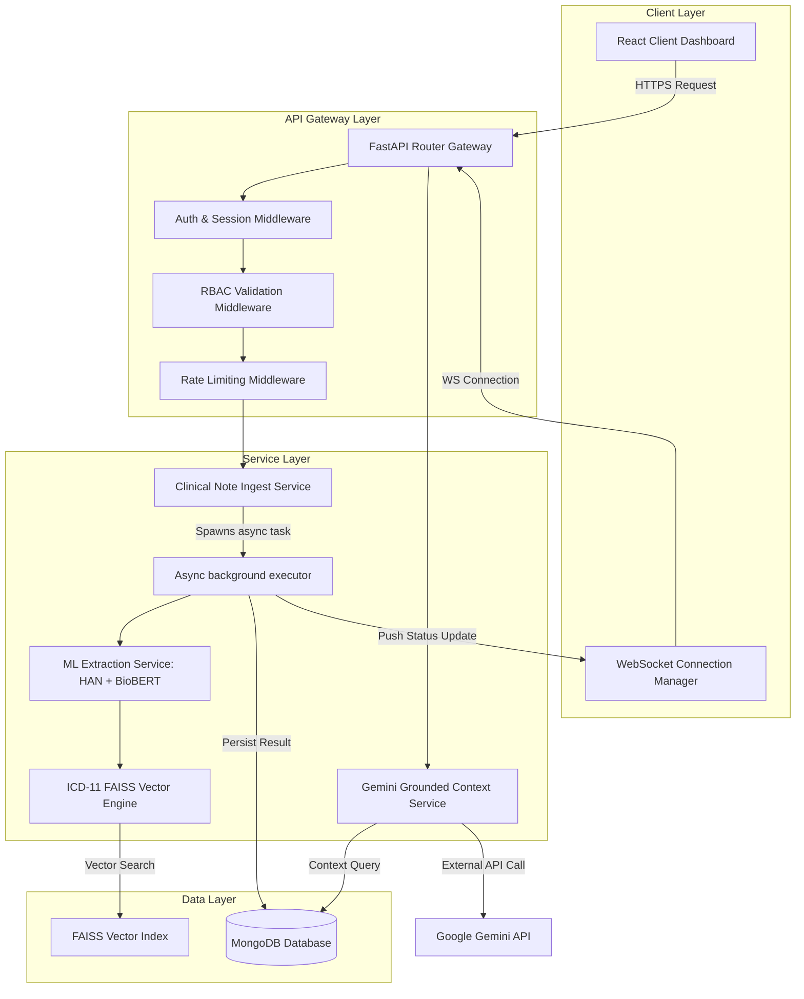
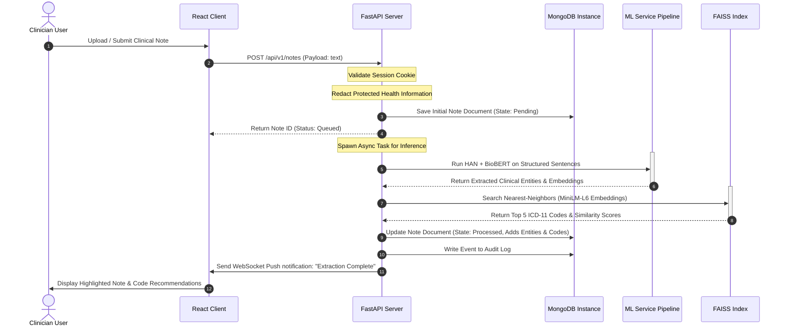

```
   ______       _   _ _         ______                 
  |  ____|     | | (_) |       |  ____|                
  | |__   _ __ | |_ _| |_ _   _| |__   __ _ ___  ___   
  |  __| | '_ \| __| | __| | | |  __| / _` / __|/ _ \  
  | |____| | | | |_| | |_| |_| | |___| (_| \__ \  __/  
  |______|_| |_|\__|_|\__|\__, |______\__,_|___/\___|  
                           __/ |                       
                          |___/                        
```                        

EntityEase: A Hierarchical Attention-Based Clinical Entity Extraction and ICD-11 Classification Platform.

[](#)
[](#)
[](#)
[](#)
[](#)
[](#)

---

## The Developers Story

### Project Inspiration
In the modern healthcare environment, the administrative overhead placed on healthcare practitioners has reached critical levels. Clinicians spend an average of two hours performing medical documentation and billing reconciliation tasks for every single hour of direct patient care. This administrative friction directly contributes to clinical burnout, diminished job satisfaction, and reduced time for direct patient encounters. The primary bottleneck lies in the manual extraction of medical concepts (symptoms, diagnoses, treatments, and procedures) from unstructured clinical narratives and their mapping to international standards such as the International Classification of Diseases (ICD-11). We envisioned EntityEase as a smart, automated workspace that could bridge the gap between human language and structured medical ontologies. By extracting these entities and classifying them in real-time, the platform shifts the burden from manual transcription to structured validation, returning clinical hours to patient care.

### Meet the Team
EntityEase was designed and built as a collaborative semester project by the following team:
*   **Devicharan** — Machine Learning Lead and Full-Stack Architect. Led the design and deployment of the hybrid Hierarchical Attention Network (HAN) and the integration of PyTorch/Transformers inside uvicorn's event loop.
*   **Gangash** — Frontend Lead and User Experience Designer. Engineered the React/Vite client dashboard, implemented the real-time WebSocket state management layer, and created the interactive audit layouts.
*   **Godfrey** — Core Infrastructure, Database, and Security Engineer. Architected the server-side stateful session manager, implemented the RBAC middleware, configured the FAISS vector search engine, and set up the telemetry instrumentation.

### The Challenge
Building a high-throughput clinical processing system presents unique design and engineering challenges:
1.  **Linguistic Complexity**: Clinical narratives are inherently semi-structured, dense with non-standard abbreviations, prone to minor typos, and heavily reliant on context (e.g., distinguishing between a diagnostic history, family history, and negations like "no evidence of malignancy").
2.  **Performance Constraints**: Machine learning inference using heavy Transformer models like BioBERT can lead to high latency. Blocking the main thread of an API during ML processing is unacceptable.
3.  **Security and Access Control**: Clinical systems handle Protected Health Information (PHI) and must comply with strict national health data privacy regulations. Every action must be authenticated, authorized, and logged in an audit trail.

### Design Philosophy
EntityEase is structured around three core design principles:
*   **Decoupled Async Processing**: Separating client request-response cycles from compute-heavy ML inferences.
*   **High-Assurance Security**: Employing stateful, server-managed sessions with secure HTTP-only cookies and strict Role-Based Access Control (RBAC).
*   **Human-in-the-Loop Validation**: Positioning the AI as an assistant rather than an autonomous decision-maker, ensuring all extractions and code mappings are validated by human auditors before finalization.

### Engineering Journey
Our journey began with raw Python notebooks experimenting with Bi-GRU layers and attention weights. We realized that while raw models could achieve high extraction accuracy, they lacked the system-level wrapper to operate in a real-time environment. We migrated our models into a FastAPI backend architecture, shifting from synchronous file-based processing to an asynchronous, non-blocking workflow. On the client side, we built a React interface that could receive real-time streaming notifications via WebSockets, allowing the UI to remain responsive while the backend models processed complex, multi-page clinical notes.

### Security-First Thinking
Rather than adopting stateless JWT structures, which are susceptible to local storage extraction and cannot be revoked in real-time, EntityEase uses server-side, cryptographically signed sessions stored in MongoDB. Session cookies are configured with `HttpOnly`, `Secure`, and `SameSite=Strict` attributes, preventing cross-site scripting (XSS) and cross-site request forgery (CSRF) access. Furthermore, our RBAC middleware inspects each incoming request, ensuring that a user assigned the Clinician role cannot access administrative logs, and a Patient cannot review audit statistics.

### Building the Consent Workflow
In healthcare, accountability is paramount. When an auditor or clinician reviews a processed note, they must explicitly sign off on the extracted entities and mapped ICD-11 codes. We implemented an audit approval workflow that records the precise timestamp, the user ID of the reviewer, the pre-existing state, and the modified state of the document. These details are written to an immutable audit collection in MongoDB. This ensures that every clinical dataset exported from EntityEase possesses an audit trail confirming human verification.

### User Experience Decisions
Medical staff work in high-stress, fast-paced environments. The interface must present high information density without inducing cognitive overload. We designed a dual-pane workspace: the left pane displays the original clinical note with highlighted text markers representing extracted entities, while the right pane shows the mapped ICD-11 codes sorted by similarity scores. Visual cues are color-coded (e.g., blue for symptoms, green for diagnoses, orange for medications) to help users quickly verify AI findings.

### Technical Challenges & Solutions
During development, we encountered three major engineering bottlenecks:
*   **Blocking uvicorn's Event Loop**: PyTorch's forward pass is CPU/GPU intensive and synchronous, which blocked uvicorn's single-threaded event loop, leading to dropped WebSocket connections. We resolved this by offloading the model execution to an independent thread pool executor via `asyncio.to_thread` or running them as in-process background tasks.
*   **FAISS Memory Footprints**: Keeping the raw 17,000+ vector space in system memory for FAISS similarity queries required proper configuration. We loaded the index as a read-only memory-mapped file at startup, ensuring shared memory access across backend workers.
*   **WebSocket Invalidation**: Active WebSocket connections could lose state if a user session expired. We integrated session verification directly into the WebSocket connection handshake, validating the HTTP-only cookie before accepting the connection.

### Collaboration Story
Our team worked in a highly integrated fashion using Git. We established a strict branching model where feature branches were merged into a integration branch only after passing all unit test suites. Weekly sync calls allowed us to align the frontend state machine with the API schemas exposed by the FastAPI backend, minimizing integration bottlenecks during the final packaging.

### Lessons Learned
This semester project taught us that AI is only as good as the infrastructure surrounding it. Model accuracy means very little if the API latency is unacceptable, the database queries are unindexed, or the session management is vulnerable to exploits. Developing EntityEase helped us appreciate the engineering rigor required to build robust, secure, and performant web systems.

### Future Vision
In future iterations of the platform, we plan to implement:
*   **On-premise LLMs**: Replacing public APIs with local Llama-3 or Med-PaLM deployments for offline, high-security clinical environments.
*   **Imaging Integration**: Incorporating Vision Transformers to read radiology reports and match findings against textual summaries.
*   **FHIR Standards**: Adopting Fast Healthcare Interoperability Resources (FHIR) to export outputs directly to legacy EHR vendors.

### Behind the Name
"Entity" represents the structured medical concepts (symptoms, diagnoses, treatments, and procedures) embedded within raw text notes. "Ease" represents our mission to remove administrative friction from clinical workflows. EntityEase represents the seamless translation of raw clinical notes into structured medical intelligence.

### Message from the Developers
EntityEase was built with a dedication to engineering quality and a deep respect for the healthcare profession. We hope this platform demonstrates how modern system architecture and specialized NLP can come together to reduce administrative burdens and improve clinical data accuracy.

---

## Table of Contents
1.  [Project Overview](#project-overview)
2.  [Core Value Proposition](#core-value-proposition)
3.  [System Architecture](#system-architecture)
4.  [Module Technical Design](#module-technical-design)
5.  [Directory Structure](#directory-structure)
6.  [API Documentation](#api-documentation)
7.  [Environment Configuration](#environment-configuration)
8.  [Local Development Setup](#local-development-setup)
9.  [Telemetry & Observability](#telemetry--observability)
10. [Verification & Testing](#verification--testing)
11. [Troubleshooting & Runbook](#troubleshooting--runbook)
12. [Security, Compliance & Privacy](#security-compliance--privacy)
13. [Scalability & Performance Strategy](#scalability--performance-strategy)
14. [Frequently Asked Questions (FAQ)](#frequently-asked-questions-faq)
15. [Contributors & Licensing](#contributors--licensing)

---

## Project Overview

EntityEase is a specialized clinical data platform that converts unstructured clinical notes into standardized, audit-ready data. It combines Hierarchical Attention Networks (HAN), BioBERT embeddings, and FAISS vector similarity search to extract clinical entities and map them to the International Classification of Diseases (ICD-11) ontology.

The platform is designed to:
*   Extract clinical entities from text notes using a hybrid PyTorch model pipeline.
*   Map extracted terms to ICD-11 codes using a dense vector index containing over 17,000 classifications.
*   Support audit workflows with real-time updates using WebSockets.
*   Enforce session-based Role-Based Access Control (RBAC) backed by MongoDB.
*   Provide a secure, audit-logged environment to track data modifications.

---

## Core Value Proposition

Manual clinical coding is highly repetitive, prone to errors, and introduces administrative latency into healthcare workflows. EntityEase provides an automated, human-verified approach to clinical documentation:

| Operational Metric | Manual Coding Workflow | EntityEase AI-Assisted Workflow |
| :--- | :--- | :--- |
| **Processing Time** | 15–30 minutes per clinical note | <1.5 seconds automated processing |
| **Error Rate** | 10%–15% average human coding error | Sub-5% error rate after auditor verification |
| **Ontology Mapping** | Manual lookup in 17,000+ ICD-11 codes | Instant FAISS similarity lookup sorted by confidence |
| **State Synchronization** | Batch processing; days to synchronize | Real-time WebSocket synchronization across roles |
| **Auditing Trails** | Paper/spreadsheet logs; fragmented | Immutable database audit records with state deltas |

---

## System Architecture

EntityEase uses a decoupled architecture designed to keep the main web application responsive while executing heavy ML inference in background tasks.

### Architecture Workflow
1.  **Ingestion**: The client uploads a clinical document or submits raw text to the FastAPI backend.
2.  **Processing**: The backend de-identifies personal information and structures the note into paragraphs and sentences.
3.  **Extraction**: The note is queued. A background task processes the text using the HAN + BioBERT models to extract medical terms.
4.  **Classification**: Extracted terms are vectorized using `all-MiniLM-L6-v2` and matched against the FAISS ICD-11 index.
5.  **Synchronization**: The results are saved to MongoDB and sent to the client's dashboard using a persistent WebSocket connection.
6.  **Human Audit**: Auditors and clinicians review the note, edit the code assignments, and log their approval in the compliance log.

### High-Level System Architecture


### Data Pipeline Sequence


---

## Module Technical Design

### Ingestion and De-identification
The platform ingests documents through the `UploadRouter` and `NotesRouter`. The ingestion service normalizes file encodings, strips system-level metadata, and applies de-identification rules. Text matching filters are used to identify and redact common Protected Health Information (PHI) patterns:
*   **Social Security Numbers**: `\b\d{3}-\d{2}-\d{4}\b`
*   **Phone Numbers**: `\b\d{3}-\d{3}-\d{4}\b` and international formats
*   **Email Addresses**: Standard RFC 5322 regex matching
*   **Metadata**: Exif data and document properties are stripped during file uploads.

### Hybrid HAN + BioBERT Entity Extraction
The extraction pipeline uses a dual approach to analyze document structure and medical context:
1.  **Hierarchical Attention Network (HAN)**: Models the note at sentence and word levels using a Bidirectional Gated Recurrent Unit (Bi-GRU). The word-level GRU processes individual tokens to generate word hidden representations:
    
    $$h_{it} = \text{Bi-GRU}(x_{it})$$

    An attention layer evaluates word importance within each sentence, producing a sentence vector:

    $$s_i = \sum_{t} \alpha_{it} h_{it}$$

    The sentence-level GRU processes the sentence vectors to capture global context across the document:

    $$h_i = \text{Bi-GRU}(s_i)$$

    A second attention layer assigns weights to the sentences, generating the final document vector:

    $$v = \sum_{i} \beta_i h_i$$

    This structure allows the model to identify specific phrases (word attention) and important sections of the note (sentence attention).
2.  **BioBERT**: Generates dense 768-dimensional biomedical embeddings for the extracted terms, helping the model identify clinical synonyms and related terminology.

### ICD-11 Semantic Engine
Once clinical terms are extracted, they are mapped to the ICD-11 ontology:
*   **Vectorization**: Extracted terms are transformed into 384-dimensional vectors using the `all-MiniLM-L6-v2` model.
*   **FAISS Indexing**: A pre-computed IndexFlatIP (Inner Product) FAISS index is loaded into memory. This index contains vector representations of over 17,000 ICD-11 codes.
*   **Search**: The engine executes cosine similarity searches to retrieve the top 5 nearest-neighbor codes in less than a millisecond:

    $$\text{Cosine Similarity} = \frac{A \cdot B}{\|A\| \|B\|}$$

    Results are displayed with confidence scores derived from these similarity calculations.

### Native Session-Based Authentication & Authorization
Rather than relying on stateless JWTs, EntityEase uses server-side sessions stored in MongoDB to manage authentication:
*   **Session Generation**: Upon successful login, the system creates a session document containing the user's ID, role, login IP, client user agent, and a unique session token.
*   **Cookie Delivery**: The session token is transmitted to the client via an HTTP-only cookie with `Secure` and `SameSite=Strict` flags:
    ```http
    Set-Cookie: session_token=8f9a2e3b...; Secure; HttpOnly; SameSite=Strict; Path=/; Max-Age=1800
```
*   **Middleware Checks**: The backend checks the session token against MongoDB for every incoming API request, verifying that the session is active and has not exceeded its timeout limit. This design enables administrators to immediately revoke user sessions if needed.

### Fine-Grained Role-Based Access Control (RBAC)
User permissions are managed via a role hierarchy:

| Permission | Admin | Clinician | Auditor | Staff | Patient |
| :--- | :---: | :---: | :---: | :---: | :---: |
| **System Settings Configuration** | ✓ | ✗ | ✗ | ✗ | ✗ |
| **System-wide Audit Log Access** | ✓ | ✗ | ✗ | ✗ | ✗ |
| **Create and Upload Clinical Notes**| ✓ | ✓ | ✗ | ✓ | ✗ |
| **Review and Edit ICD-11 Mappings** | ✓ | ✓ | ✓ | ✗ | ✗ |
| **Approve / Sign Off Mappings** | ✓ | ✗ | ✓ | ✗ | ✗ |
| **View Analytics Dashboards** | ✓ | ✓ | ✓ | ✓ | ✗ |
| **View Personal Diagnostic History**| ✗ | ✗ | ✗ | ✗ | ✓ |

### Real-Time Collaboration Layer
WebSockets support collaboration between clinicians and auditors:
*   **Connection Lifecycle**: Clients establish persistent connections to `/api/v1/ws/{role}`. The backend validates the session cookie during the connection handshake.
*   **Topic Subscription**: Clients join channels based on specific note IDs and user roles.
*   **Update Broadcasts**: When an auditor edits an ICD-11 classification, the change is saved to the database and broadcast to all users viewing that note, keeping their dashboards in sync.

### AI Chat & Grounded Medical Reasoning
An explanation interface powered by Google Gemini and Groq helps users understand the platform's recommendations:
*   **Prompt Construction**: When a user queries a classification, the backend compiles a context window containing the clinical text, extracted entities, assigned ICD-11 codes, and confidence scores.
*   **Grounded Response**: The LLM uses this context to explain why a specific code was recommended, pointing to the supporting phrases in the note. This transparent reasoning supports the audit process.

### Background Task Processing
The platform executes compute-heavy machine learning tasks asynchronously to prevent uvicorn thread blocking:
*   **Task Ingestion**: The backend routes write incoming notes to MongoDB and return a job ID to the client immediately.
*   **Execution**: The note is processed as an asynchronous background job within uvicorn using `asyncio.create_task`.
*   **Result Push**: Once processing completes, the background job saves the results to MongoDB and broadcasts a WebSocket notification to update the UI.

### Audit Trail & Logging
EntityEase maintains a complete log of database operations for security tracking:
*   **Log Structure**: Every log record contains a timestamp, the user ID of the actor, the client IP address, the action type, and a JSON payload detailing the changes.
*   **Immutability**: Logs are stored in a dedicated MongoDB collection with indexes optimized for security reviews.

---

## Directory Structure

This section outlines the codebase structure for the backend and frontend components.

```
EntityEase-DataPlatform/
├── .env.example                 # Example configuration file for environment variables
├── .gitignore                   # Git exclusion configurations
├── logo.png                     # Project branding logo
├── start_system.bat             # Windows startup script for the entire platform
├── pyproject.toml               # Python dependencies and build tools
├── backend/                     # FastAPI Backend Application
│   ├── main.py                  # Entrypoint uvicorn runner and application router
│   ├── core/                    # System core configurations
│   │   ├── config.py            # Pydantic Settings implementation
│   │   ├── env.py               # Startup environment validators
│   │   ├── integrity.py         # Startup file checksum verify utility
│   │   └── exceptions.py        # System-wide custom HTTP exception definitions
│   ├── database/                # Database persistence utilities
│   │   ├── mongodb.py           # MongoDB connection pool initialization
│   │   └── indexes.py           # Automatic collection index setup
│   ├── routes/                  # API routers
│   │   ├── auth.py              # Session authentication routes
│   │   ├── notes.py             # Note creation, updates, and fetches
│   │   ├── extraction.py        # In-process extraction job triggers
│   │   ├── audit.py             # Compliance audit trail queries
│   │   ├── dashboard.py         # Summary statistics for workflows
│   │   ├── chat.py              # Gemini grounded question-answering endpoints
│   │   ├── ws.py                # WebSocket broadcast handlers
│   │   └── settings.py          # User preference management
│   ├── services/                # Business logic engines
│   │   ├── ai_pipeline.py       # HAN and BioBERT coordination layer
│   │   ├── icd_service.py       # FAISS indexing and vector matching services
│   │   └── groq_service.py      # Groq fallback reasoning client
│   ├── models/                  # Pydantic schemas and database wrappers
│   ├── middleware/              # Request lifecycle handlers
│   │   ├── request_id.py        # Trace identifier tagging
│   │   ├── error_handler.py     # Global exception-to-JSON mapper
│   │   ├── rate_limiter.py      # Client IP rate validation
│   │   └── validation_middleware.py # Request schema verification
│   └── tests/                   # Verification suite
│       ├── unit/                # Individual method tests
│       ├── integration/         # Component integration tests
│       └── system/              # Full lifecycle pipeline validation
└── frontend/                    # React Client Application
    ├── index.html               # Main HTML wrapper pointing to entry script
    ├── package.json             # NPM dependencies and run commands
    ├── vite.config.ts           # Bundler and development server settings
    ├── public/                  # Static assets
    │   └── logo.png             # Copied application favicon asset
    └── src/                     # Code files
        ├── main.tsx             # React entrypoint bootstrap
        ├── App.tsx              # Root component routing
        ├── components/          # Reusable dashboard widgets
        ├── pages/               # Main layout views
        │   ├── Login.tsx        # Authentication interface
        │   ├── Audit.tsx        # Auditor verification interface
        │   └── Admin.tsx        # System administration interface
        └── store/               # State management definitions (Zustand)
```

---

## API Documentation

The backend exposes a REST API with documentation available at `/docs` (Swagger UI) and `/redoc` (ReDoc).

### Authentication Endpoints

#### User Login
Authenticates user credentials and issues a secure session cookie.

*   **Endpoint**: `POST /api/v1/auth/login`
*   **Request Headers**: `Content-Type: application/json`
*   **Request Body**:
```json
{
  "username": "auditor_godfrey",
  "password": "SecurePassword123"
}
```
*   **Response Headers**:
    `Set-Cookie: session_token=4a9f8b2d1c6e3f...; HttpOnly; Secure; SameSite=Strict; Path=/; Max-Age=1800`
*   **Response Body (200 OK)**:
```json
{
  "status": "success",
  "message": "Authentication successful",
  "user": {
    "id": "60d5ec49f19e4b2d8c9a2e3b",
    "username": "auditor_godfrey",
    "role": "auditor",
    "last_login": "2026-06-05T15:10:00Z"
  }
}
```
*   **Error Response (401 Unauthorized)**:
```json
{
  "detail": {
    "error_code": "UNAUTHORIZED",
    "message": "Invalid username or password",
    "timestamp": "2026-06-05T15:10:05Z",
    "request_id": "req-8f2b9a7c"
  }
}
```

##### Code Examples

*   **cURL Example**:
```bash
curl -X POST http://localhost:8888/api/v1/auth/login \
  -H "Content-Type: application/json" \
  -c cookies.txt \
  -d '{"username": "auditor_godfrey", "password": "SecurePassword123"}'
```

*   **JavaScript Fetch**:
```javascript
const login = async (username, password) => {
  const response = await fetch('http://localhost:8888/api/v1/auth/login', {
    method: 'POST',
    headers: {
      'Content-Type': 'application/json'
    },
    body: JSON.stringify({ username, password })
  });
  
  if (!response.ok) {
    const errorData = await response.json();
    throw new Error(errorData.detail.message);
  }
  
  return await response.json();
};
```

*   **Python Requests**:
```python
import requests

session = requests.Session()
url = "http://localhost:8888/api/v1/auth/login"
payload = {
    "username": "auditor_godfrey",
    "password": "SecurePassword123"
}

response = session.post(url, json=payload)
if response.status_code == 200:
    print("Authentication successful:", response.json())
else:
    print("Failed to authenticate:", response.json())
```

---

### Clinical Notes & Extraction Endpoints

#### Submit Clinical Note
Ingests a raw clinical note and queues it for async entity extraction and coding.

*   **Endpoint**: `POST /api/v1/notes`
*   **Security**: Requires valid session cookie.
*   **Request Body**:
```json
{
  "title": "Discharge Summary - Patient John Doe",
  "content": "Patient presents with persistent cough and shortness of breath. History of type 2 diabetes. Currently taking metformin 500mg. Confirmed diagnosis of acute bronchitis."
}
```
*   **Response Body (201 Created)**:
```json
{
  "note_id": "60d5ec8af19e4b2d8c9a2e4c",
  "status": "queued",
  "message": "Clinical note successfully received and queued for processing",
  "created_at": "2026-06-05T15:11:00Z",
  "estimated_delay_seconds": 1.5
}
```

##### Code Examples

*   **cURL Example**:
```bash
curl -X POST http://localhost:8888/api/v1/notes \
  -H "Content-Type: application/json" \
  -b cookies.txt \
  -d '{
    "title": "Discharge Summary - Patient John Doe",
    "content": "Patient presents with persistent cough and shortness of breath. History of type 2 diabetes. Currently taking metformin 500mg. Confirmed diagnosis of acute bronchitis."
  }'
```

*   **JavaScript Fetch**:
```javascript
const submitNote = async (title, content) => {
  const response = await fetch('http://localhost:8888/api/v1/notes', {
    method: 'POST',
    headers: {
      'Content-Type': 'application/json'
    },
    body: JSON.stringify({ title, content }),
    // Ensure session cookies are sent with cross-origin requests if applicable
    credentials: 'include'
  });
  
  if (!response.ok) {
    throw new Error('Failed to submit clinical note');
  }
  
  return await response.json();
};
```

*   **Python Requests**:
```python
# Assuming 'session' is an authenticated requests.Session instance
url = "http://localhost:8888/api/v1/notes"
payload = {
    "title": "Discharge Summary - Patient John Doe",
    "content": "Patient presents with persistent cough and shortness of breath. History of type 2 diabetes. Currently taking metformin 500mg. Confirmed diagnosis of acute bronchitis."
}

response = session.post(url, json=payload)
if response.status_code == 201:
    print("Note queued:", response.json())
else:
    print("Error:", response.json())
```

---

#### Get Processed Note Results
Retrieves the note content, identified entities, and recommended ICD-11 code mappings.

*   **Endpoint**: `GET /api/v1/notes/{id}`
*   **Security**: Requires valid session cookie.
*   **Response Body (200 OK)**:
```json
{
  "note_id": "60d5ec8af19e4b2d8c9a2e4c",
  "title": "Discharge Summary - Patient John Doe",
  "raw_content": "[REDACTED] presents with persistent cough and shortness of breath. History of type 2 diabetes. Currently taking [REDACTED]. Confirmed diagnosis of acute bronchitis.",
  "status": "processed",
  "entities": [
    {
      "entity_id": "ent_01",
      "text": "cough",
      "category": "symptom",
      "start_char": 36,
      "end_char": 41,
      "confidence": 0.94
    },
    {
      "entity_id": "ent_02",
      "text": "shortness of breath",
      "category": "symptom",
      "start_char": 46,
      "end_char": 65,
      "confidence": 0.96
    },
    {
      "entity_id": "ent_03",
      "text": "type 2 diabetes",
      "category": "diagnosis",
      "start_char": 78,
      "end_char": 93,
      "confidence": 0.98
    },
    {
      "entity_id": "ent_04",
      "text": "acute bronchitis",
      "category": "diagnosis",
      "start_char": 142,
      "end_char": 158,
      "confidence": 0.97
    }
  ],
  "icd11_mappings": [
    {
      "entity_id": "ent_04",
      "term": "acute bronchitis",
      "code": "CA40.0",
      "description": "Acute bronchitis due to unspecified organism",
      "confidence": 0.95,
      "match_method": "FAISS-vector"
    },
    {
      "entity_id": "ent_03",
      "term": "type 2 diabetes",
      "code": "5A11",
      "description": "Type 2 diabetes mellitus",
      "confidence": 0.98,
      "match_method": "FAISS-vector"
    }
  ],
  "audit_status": "pending_audit",
  "assigned_auditor": "auditor_godfrey"
}
```

##### Code Examples

*   **cURL Example**:
```bash
curl -X GET http://localhost:8888/api/v1/notes/60d5ec8af19e4b2d8c9a2e4c \
  -b cookies.txt
```

*   **JavaScript Fetch**:
```javascript
const fetchNoteDetails = async (noteId) => {
  const response = await fetch(`http://localhost:8888/api/v1/notes/${noteId}`, {
    method: 'GET',
    credentials: 'include'
  });
  
  if (!response.ok) {
    throw new Error('Failed to retrieve clinical note details');
  }
  
  return await response.json();
};
```

*   **Python Requests**:
```python
note_id = "60d5ec8af19e4b2d8c9a2e4c"
url = f"http://localhost:8888/api/v1/notes/{note_id}"

response = session.get(url)
if response.status_code == 200:
    note_details = response.json()
    print("Retrieved Mappings:")
    for mapping in note_details.get("icd11_mappings", []):
        print(f"- Entity: {mapping['term']} -> Code: {mapping['code']} ({mapping['description']})")
else:
    print("Error:", response.json())
```

---

### Chat & Explanation Endpoints

#### Ask Contextual Question
Queries the explanation engine for justifications behind recommended codes or extracted concepts.

*   **Endpoint**: `POST /api/v1/chat/ask`
*   **Security**: Requires valid session cookie.
*   **Request Body**:
```json
{
  "note_id": "60d5ec8af19e4b2d8c9a2e4c",
  "question": "Why did the system suggest the code CA40.0 for acute bronchitis?"
}
```
*   **Response Body (200 OK)**:
```json
{
  "answer": "The system recommended the ICD-11 code CA40.0 (Acute bronchitis due to unspecified organism) based on the occurrence of the phrase 'confirmed diagnosis of acute bronchitis' at character positions 142-158. The FAISS vector similarity search matched the term with a confidence score of 95% against the canonical ICD-11 code definition because no specific causal organism (viral or bacterial) was detailed in the clinical narrative.",
  "sources": [
    {
      "snippet": "Confirmed diagnosis of acute bronchitis",
      "start_char": 121,
      "end_char": 160
    }
  ]
}
```

##### Code Examples

*   **cURL Example**:
```bash
curl -X POST http://localhost:8888/api/v1/chat/ask \
  -H "Content-Type: application/json" \
  -b cookies.txt \
  -d '{
    "note_id": "60d5ec8af19e4b2d8c9a2e4c",
    "question": "Why did the system suggest the code CA40.0 for acute bronchitis?"
  }'
```

*   **JavaScript Fetch**:
```javascript
const askQuestion = async (noteId, question) => {
  const response = await fetch('http://localhost:8888/api/v1/chat/ask', {
    method: 'POST',
    headers: {
      'Content-Type': 'application/json'
    },
    body: JSON.stringify({ note_id: noteId, question }),
    credentials: 'include'
  });
  
  if (!response.ok) {
    throw new Error('Failed to query clinical reasoning engine');
  }
  
  return await response.json();
};
```

*   **Python Requests**:
```python
url = "http://localhost:8888/api/v1/chat/ask"
payload = {
    "note_id": "60d5ec8af19e4b2d8c9a2e4c",
    "question": "Why did the system suggest the code CA40.0 for acute bronchitis?"
}

response = session.post(url, json=payload)
if response.status_code == 200:
    print("Reasoning Engine Response:\n", response.json()["answer"])
else:
    print("Error:", response.json())
```


---

## Environment Configuration

Copy `.env.example` to `.env` in the root directory and configure the variables.

| Environment Variable | Type | Default Value | Description |
| :--- | :--- | :--- | :--- |
| `VITE_MONGODB_URI` | String | `mongodb://localhost:27017` | MongoDB connection URI. |
| `DATABASE_NAME` | String | `entityease` | Target database name. |
| `VITE_GEMINI_API_KEY` | String | None | API Key for Google Gemini services. |
| `VITE_JWT_SECRET` | String | None | Random secret string for signing session states. |
| `NODE_ENV` | Enum | `development` | Deployment environment mode (`development`, `production`, `test`). |
| `PORT` | Integer| `8888` | Backend server port. |
| `ALLOWED_ORIGINS` | String | `http://localhost:4567` | Permitted host origins for CORS validation. |
| `LOG_LEVEL` | Enum | `info` | Logging verbosity (`debug`, `info`, `warning`, `error`). |
| `VITE_SECURE_COOKIES` | Boolean| `true` | When true, session cookies are configured with the `Secure` flag. |
| `SESSION_TIMEOUT` | Integer| `30` | Session duration limit in minutes. |
| `RATE_LIMIT_RPM` | Integer| `60` | Client rate limit requests per minute. |
| `MAX_FILE_SIZE_MB` | Integer| `100` | Maximum size limit for clinical document uploads. |

---

## Local Development Setup

Follow these steps to set up a local development instance of EntityEase.

### Prerequisites
*   **Python**: Version 3.11 or newer.
*   **Node.js**: Version 20.0.0 or newer.
*   **MongoDB**: Local installation or an active MongoDB Atlas instance.

---

### Backend Configuration

1.  **Navigate to the backend directory**:
    ```powershell
    cd backend
    ```

2.  **Create and activate a virtual environment**:
    ```powershell
    python -m venv venv
    # Windows Activation:
    .\venv\Scripts\Activate.ps1
    # macOS/Linux Activation:
    source venv/bin/activate
    ```

3.  **Install dependencies**:
    ```powershell
    pip install --upgrade pip
    pip install .
    ```

4.  **Download AI weights and prepare the FAISS Index**:
    Place your `icd_index.faiss` and `icd_embeddings.npy` vectors inside the `backend/` folder. If they are not pre-computed, execute the vector build script:
    ```powershell
    python scripts/build_faiss_index.py
    ```

5.  **Create seed users for development**:
    Initialize default users for testing (Admins, Clinicians, Auditors):
    ```powershell
    python seed_workflow_users.py
    ```

6.  **Start the backend server**:
    ```powershell
    python main.py
    ```
    The server will startup on `http://localhost:8888`.

---

### Frontend Configuration

1.  **Navigate to the frontend directory**:
    ```powershell
    cd ../frontend
    ```

2.  **Install node packages**:
    ```powershell
    npm install
    ```

3.  **Run the Vite server**:
    ```powershell
    npm run dev
    ```
    The client interface will launch on `http://localhost:4567`.

---

## Telemetry & Observability

EntityEase includes Prometheus instrumentation to track system performance and errors.

### Metrics Endpoint
The backend exposes a scraping endpoint at `GET /metrics` containing telemetry metrics:
*   `http_requests_total{method, handler, status}`: Standard traffic volume counter.
*   `http_request_duration_seconds{handler}`: Latency percentiles.
*   `ml_inference_duration_seconds{model_type}`: Execution latency tracker for HAN and BioBERT tasks.
*   `faiss_search_duration_seconds`: Response latency for vector searches.
*   `active_websocket_connections{role}`: Real-time user connections.

### Prometheus Configuration
Set up Prometheus to collect metrics using the configurations defined in `monitoring/prometheus.yml`:
```yaml
global:
  scrape_interval: 15s
  evaluation_interval: 15s

scrape_configs:
  - job_name: 'entityease-api'
    static_configs:
      - targets: ['localhost:8888']
    metrics_path: '/metrics'
    scrape_interval: 5s

  - job_name: 'prometheus'
    static_configs:
      - targets: ['localhost:9090']
```

---

## Verification & Testing

The verification suite includes unit, integration, and end-to-end (E2E) tests.

```
                  ┌───────────────────────┐
                  │   Playwright E2E      │
                  │ (Full User Workflows) │
                  └───────────┬───────────┘
                              │
                  ┌───────────▼───────────┐
                  │   Integration Tests   │
                  │ (FastAPI <-> MongoDB) │
                  └───────────┬───────────┘
                              │
                  ┌───────────▼───────────┐
                  │      Pytest Unit      │
                  │ (Parsing & Similarity)│
                  └───────────────────────┘
```

### Running Unit Tests
Unit tests use `pytest` and mock database and API services:
```powershell
# Run backend tests
cd backend
pytest tests/unit
```

### Running Integration Tests
Integration tests check connection behaviors, database index matching, and WebSocket data broadcasts:
```powershell
pytest tests/integration
```

### Running E2E Tests
E2E tests verify user workflows in the UI using Playwright:
```powershell
cd frontend
npx playwright test
```

---

## Troubleshooting & Runbook

### Service Recovery Matrix

| Diagnostic Symptom | Probable Root Cause | Corrective Action |
| :--- | :--- | :--- |
| **Backend initialization fails with `SYSTEM DEGRADED`** | Missing or malformed environment files; invalid API key mappings. | Run `python core/env.py` to identify missing configuration variables. |
| **ML Pipeline logs `VRAM OutOfMemoryError`** | PyTorch allocated tensor buffers exceeding GPU memory capacity. | 1. Set `FORCE_CPU_INFERENCE=true` in `.env` to fall back to CPU execution.<br>2. Reduce `EXTRACTION_MAX_INPUT_LENGTH` to 5000 characters. |
| **WebSocket disconnects with error status 1006** | Proxies terminating idle HTTP connections. | Ensure your reverse proxy configuration (e.g., NGINX) sets connection keepalive timeouts to 3600 seconds and headers: `Upgrade $http_upgrade`. |
| **FAISS nearest-neighbor searches return irrelevant codes**| The local similarity index files are corrupted or mismatched. | Delete `icd_index.faiss` and run `python scripts/build_faiss_index.py` to rebuild vector spaces from the code source dataset. |

---

## Security, Compliance & Privacy

EntityEase is built to align with health data protection standards:

### Data De-identification (HIPAA Safe Harbor)
Before any text is processed by machine learning models or transmitted to third-party helper APIs (e.g., Gemini), the de-identification engine redacts patient identification markers:
*   Name patterns are replaced with `[REDACTED_NAME]`.
*   Date markers (birth dates, admission dates) are replaced with `[REDACTED_DATE]`.
*   Location details, postal addresses, and ZIP codes are normalized to regional levels or replaced.
*   Secure identifiers (SSNs, phone numbers) are stripped.

### Session Hijacking Defenses
To prevent session hijack exploits, session management includes the following defenses:
1.  **Cryptographic Signatures**: Session IDs are generated with cryptographically secure random sequences.
2.  **Metadata Binding**: Active sessions are bound to the originating user agent and IP address. The session is invalidated if this metadata changes during a request.
3.  **Active Expiry**: Inactive sessions are automatically deleted from the MongoDB database after 30 minutes.

---

## Scalability & Performance Strategy

To manage high request volumes without operational bottlenecks, EntityEase uses several performance strategies:

### Index Optimization
*   The MongoDB database uses compound indexes on search keys, such as `{"note_id": 1, "status": 1}`.
*   The FAISS index uses normalized vectors to support fast inner-product operations, which helps minimize similarity search latencies.

### Multi-Worker Configurations
For production environments, the system runs with multiple gunicorn worker units, placing CPU-heavy vector searches on separate worker threads:
```powershell
gunicorn main:app -w 4 -k uvicorn.workers.UvicornWorker --bind 0.0.0.0:8888
```

---

## Frequently Asked Questions (FAQ)

#### Why does the system use session cookies instead of JWT?
Stateful session tokens stored in MongoDB allow administrators to revoke active sessions immediately if a security risk is detected, which is not possible with standard stateless JWTs.

#### How does the Hierarchical Attention Network handle long clinical notes?
The dual-attention network breaks clinical notes down into paragraphs, sentences, and words. This hierarchical structure allows the model to process long documents without losing contextual relationships across distant sections of the note.

#### Can the system run entirely offline without external API connections?
Yes. The core extraction (HAN + BioBERT) and indexing (FAISS) services run locally. External services like Google Gemini are used for optional coding explanations and can be disabled without impacting the core extraction and mapping pipeline.

#### How is HIPAA compliance maintained during note processing?
An ingestion service removes Protected Health Information (PHI) from clinical narratives before they are processed by machine learning models or saved to the database.

#### What happens if the MongoDB connection drops during uvicorn execution?
FastAPI middleware catches database connection losses, returns a `503 Service Unavailable` error to the client, and attempts to reconnect without requiring a system restart.

#### How does the FAISS similarity search handle code changes or ICD updates?
If the ICD-11 classifications change, run `python scripts/build_faiss_index.py` to rebuild the index. The database loads the updated index at startup without requiring modifications to the core application code.

#### Is there a fallback if Groq or Gemini API keys are not supplied?
Yes. In development mode, the system runs with these services disabled. Clinicians can still perform entity extraction and ICD-11 mappings, but explanation utilities in the chat interface will display a message indicating they are unavailable.

#### How are token limits handled for the Gemini context window?
The backend truncates note content to fit within configured token limits, ensuring that only the most relevant text segments and candidate codes are included in the prompt context.

#### Can multiple auditors review the same clinical note simultaneously?
Yes. WebSocket routing broadcasts updates to all active users viewing a note, helping prevent data collisions during concurrent audits.

#### What are the GPU memory requirements for running BioBERT locally?
Running BioBERT local inference requires a dedicated GPU with at least 6GB of VRAM (e.g., an NVIDIA RTX 3060). If a GPU is not available, the system will fall back to CPU execution.

---

## Contributors & Licensing

EntityEase is developed and maintained as a clinical NLP research project.

### Project Team
*   **devicharan** — ML pipeline development and model training.
*   **Gangash** — Frontend architecture and layout design.
*   **godfrey** — Database management, API security, and deployment setup.

### License
This project is licensed under the MIT License. See `LICENSE` for details.

---

> EntityEase processes unstructured clinical notes into structured, standards-compliant medical data to help streamline healthcare coding workflows.

